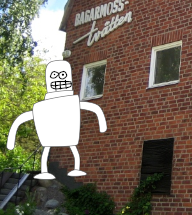

.. _masking:

########################
   Basic Masking
########################

**This tutorial gives you an overview of how masking can be done in
Synfig.**

.. _masking  About masking:

About masking
-------------

Sometimes you want your characters to go behind objects, a building in
the background for instance. If you create your background in Synfig you
can probably just place the character behind the object in your layer
stack but if your background is an image you need to do this by masking.

This tutorial will show you two basic ways of masking; hiding and
revealing using differents |Blend_Method_Parameter|

.. _masking  Hiding:

Hiding
------

|Masking\_tut\_img\_01.png| 

In this masking mode everything covered by the mask shape is hidden.

-  Create a mask shape and place it above the elements you want to mask,
   either within the same group layer or above it and then grouping the
   mask and elements together.

   
-  Set the blend method of the mask to “Alpha Over”
   ([Blend\_Method\_Parameter#Alpha\_over]).
-  Everything below the mask shape will now be hidden.

.. _masking  Revealing:

Revealing
---------

A revealing mask can be achieved by two different approaches using
different blend modes.

.. _masking  Revealing mask method 1.:

Revealing mask method 1.
------------------------

.. note::
   Warning, `actually <http://www.synfig.org/issues/thebuggenie/synfig/issues/868>`__
   broken in some cases\
   
   `Bug report
   #868 <http://www.synfig.org/issues/thebuggenie/synfig/issues/868>`__ -
   Straight Onto blend method broken (both render engine) : When using
   groups result is the same has “Straight” on the workarea and when
   rendering and cobra (0991d44751f) to render empty on vector artwork.

-  Create a masking shape and place it below the elements you want to
   mask.

 
-  Set the blend method of the elements you want to mask (robot layer in
   this case) to “Straight Onto”
   ([Blend\_Method\_Parameter#Straight\_Onto]). You can only use this
   method on one layer at a time so if you have several objects you need
   to group those into one group layer.
-  Everything above the mask will be visible, everything outside will be
   hidden.

.. _masking  Revealing mask method 2.:

Revealing mask method 2.
------------------------

This mask method is similar to the hiding mask and a bit more flexible
than revealing method 1 in that you don't have to group everything that
should be masked. This mask reveals everything below it, no matter how
many layers. |Basic\_Masking-tutorial\_06\_0.63.06.png|

-  Create a mask shape above the objects you want to mask.
-  Tick the “Invert” option of the mask.
-  Set blend method of mask to “Alpha Over”
   ([Blend\_Method\_Parameter#Alpha\_over]). Everything below the mask
   shape will be visible and the rest is masked off.
-  You can group the mask and the objects that should be masked.
   Anything outside of this group layer is not masked so leave the
   background outside in this example.

.. _masking  Revealing mask method 3.:

Revealing mask method 3.
------------------------

Using one 'mask' and one 'full mask'. To be describe (using the linked
project)

.. _masking  Tutorial files:

Tutorial files
--------------

Download :download:`tutorial files <masking_dat/Basic_masking_tutorial_files.zip>`    

