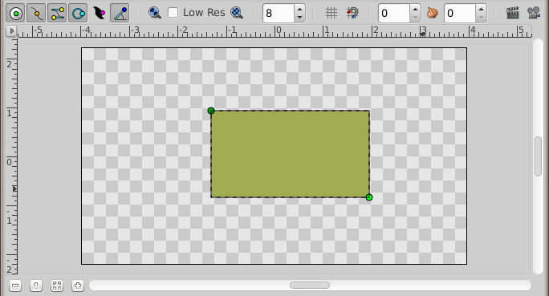
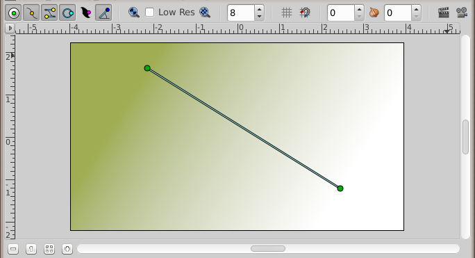
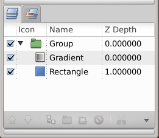
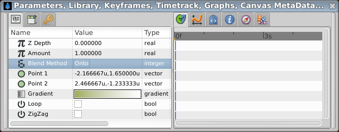
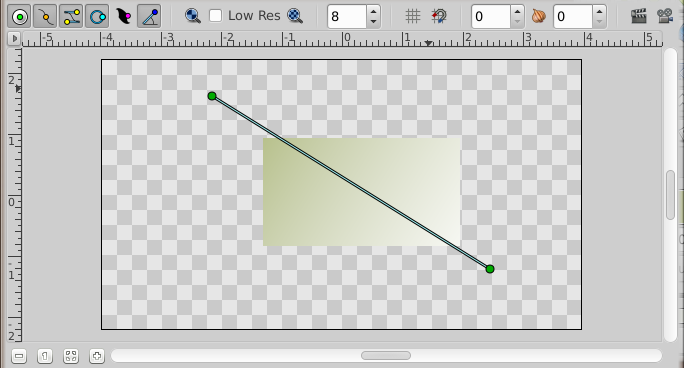
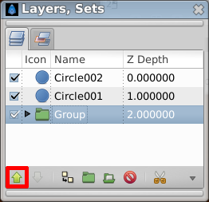
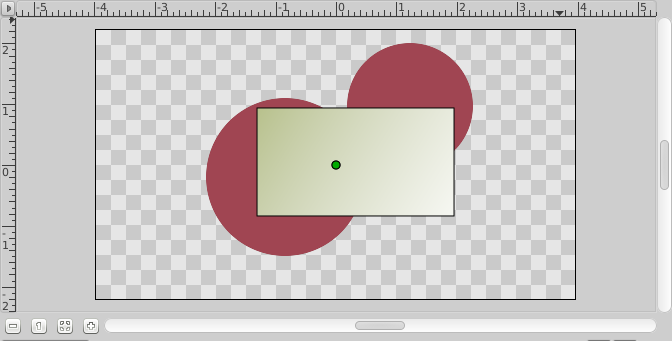
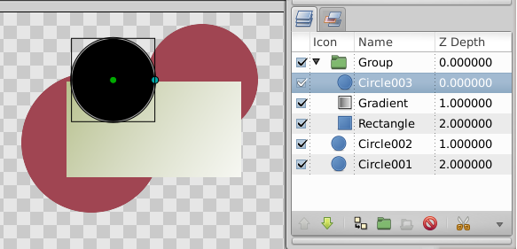
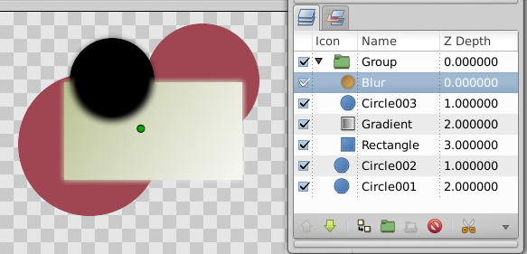

.. _working_with_layers:

########################
   Working with Layers
########################

.. _working_with_layers  Introduction:

Introduction
------------

In the `previous tutorial <Doc:Animation_Basics>`__, you made your first
simple animation by changing the attributes of
|Primitive_Layer| objects, such as: position, color, and
size. These simple types, however, are seldom sufficient to create
advanced characters and objects. To do so, Synfig uses
|Layer|. They are similar to layers used in other drawing
applications in that they are used to separate different elements of an
image.

However, Synfig's layers have following important specific:

#. Every object or |Primitive_Layer| gets its own layer.
#. You can organize layers into hierarchical groups.
#. You can use upper layers to change the behavior (or look) of
   underlying layers. Those are called |Filter_Layer|
   or effect layers.

As you will see, layers are an extremely important aspect of Synfig,
much more so than most graphics programs. Understanding the concept of
layers is an important part in understanding how Synfig works.

.. _working_with_layers  Combining layers:

Combining layers
----------------

So let's look at a simple example of how we can combine two layers to
create a gradient effect on a rectangle.

Create a new file with any duration. There's no need to bother with a
timeline at this point. Next, create a simple rectangle with the
|Rectangle_Tool|.

Pick the |Gradient_Tool| from the (Composite ([Blend
Method Parameter#Composite]) Blend Method), press the left mouse button
on the canvas, drag to change the gradient direction and release the
button when you are done. You should note that another layer was added
in the |Layers_Panel| called **Gradient**. This is
nothing special.

.. note::
   If you see no gradient but just a plain color, that means
   that you probably just clicked on the canvas without dragging your
   mouse. To fix that pick the |Transform_Tool|, click
   into the canvas to activate the gradient's handles. You need to grab the
   one you see and move it a bit until a gradient appears.

.. note ::
   If you see a spiral gradient, go to the
   |Tool_Options_Panel| and change Layer Type to
   linear by clicking on the far left icon.

You now have a gradient, but it is not what you wanted: it spreads
across the whole canvas. The goal was to have a gradient in the
rectangle. So, let's fix this now.

In the |Layers_Panel|, select both the gradient and the
rectangle layer. Then, right-click and select ``Group Layer`` from the
menu. The view of your Layers Panel should change now, showing a small
box called |Group_Layer| with a ▶ in front. By clicking on the
▶ you can expand the group layer to see its contents, your previous two
layers: the gradient and the rectangle.

 
You can treat this layer like any other layer — move it around,
duplicate it, copy and paste it. If you want to change the name of it to
something more descriptive, just select the layer in the layer tab and
click on its label. Then you just edit it in place. You can do this for
ANY layer, and are strongly encouraged to do so.

.. _working_with_layers  Using locality:

Using locality
--------------

However, there is still a problem: the gradient still covers the whole
canvas although we wanted it to be restricted on the rectangle. To do
so, activate the gradient layer in the Layers Panel. Now go to the
|Parameters_Panel| (by default it resides in the
bottom window), and search for the attribute called |Blend_Method_Parameter|. Double-click the entry and select
Onto |Blend_Method_Parameter_onto| from the drop-down menu.

 
The gradient should now be restricted to the rectangle. Congratulations!
You just made your first effect by interacting layers with Synfig.

   The gradient is restricted to the rectangle. You will found more
   informations about the various ``Blend Method`` in the
   |Blend_Method_Parameter| documentation.

If only for the additional organization, grouping layers dramatically
improves the ease of use of Synfig Studio. But lots of programs can do
this. The concept of *scope* as just demonstrated sets Synfig apart from
other programs with layer hierarchies. The key point is that a layer,
inside it's own group, will **only** modify the data contained by all
the layers and groups **below** it. In other words, if you were to throw
a |Blur_Layer| on top of the layers inside the |Group_Layer| we created, it would just blur them — anything
under the group layer would not be blurred! Let's try it.

.. _working_with_layers  Using layers to modify other layers:

Using layers to modify other layers
-----------------------------------

Make sure you have the group layer selected and create two red
|Circle_Tool|. They will appear on top of the group layer.
Select the group layer and use the ``Raise Layer`` button in the Layers
Panel to place it on top of the circles.

 
Now our group layer (with rectangle and gradient) is in front of those
two circles.

Expand the group layer to show its contents, and select the top layer
inside of it (should be the gradient layer). This is where we want to
insert the new layer. Create another circle filled with a black color.
The black circle layer will be created over the gradient layer inside
the group layer.

Now, right click on the black circle layer in the layers panel and a
popup menu will appear. The first item in that popup is ``New Layer``.
Inside of the ``New Layer`` menu, you'll see several categories of
layers you could create, but what we want is a blur, so go to the blurs
category and select the ``Blur`` layer (so that would be
``New Layer|Blurs|Blur``).

.. figure:: working_with_layers_dat/Adding-Layer-tutorial-11-0.63.06.png
   :alt: Adding-Layer-tutorial-11-0.63.06.png

 
It blurred! Has the blend method for newly created blur is ``Straight``
(if the default blend method in the Toolbox is set to
``By Layer Default``) it blurred all around the outside edge of the
contents of the group layer. You can change the default blend method
|New_Layer_Defaults_Default_Blend_Method| for new layers from the |New_Layer_Defaults| section of the Toolbox.

.. note:: 
  In the Synfig version before "0.62.02", the blend method for newly 
  created blur layers was defaulted to "Composite", that cause the 
  outside edge of the contents of the group layer is still sharp. What we 
  want is a blend method of "Straight". Just select the blur layer, 
  and change the Blend Method to "Straight" in the Parameters Panel.

   

Ok, now we have all of the contents of the group layer blurred, but
everything under it is sharp! This is because the effect of the Blur
Layer over the underlying layers is limited to the scope of the group
layer because the blur layer is inside it.

You can download the  :download:`File:Doc Adding Layers.sif <working_with_layers_dat/Doc_Adding_Layers.sif>` used for this example.

.. _working_with_layers  Digging further...:

Digging further...
------------------

If you care to look into Synfig's main menu under ``Layer|New Layer``
you will note quite a lot of different possibilities for making layers.
Several of them sound rather unusual, like ``Transform|Rotate`` for
example. You can use this to add new attributes to your objects. And
just like other, basic attributes in the `previous animation
tutorial |Animation_Basics|, you can change them to be different
on certain |Keyframe|. Synfig will take care of
interpolating the steps in between.

For example, you could create a shape and add
a |Rotate_Layer| over it. Combine this with the lesson
learned in the |Animation_Basics| and you will
obtain a rotating effect. This technique is used for the creation of
|Cut_Out_Animation|.

Let's continue digging further on shapes
creation |Creating_Shape|.

.. |Animation_Basics| replace:: :ref:`Previous Tutorial <animation_basics>`
.. |Primitive_Layer| replace:: :ref:`Primitive Layer <layers>`
.. |Layer| replace:: :ref:`Layer <layers>`
.. |Filter_Layer| replace:: :ref:`Filter Layer <layers>`
.. |Rectangle_Tool| replace:: :ref:`Rectangle Tool <tool_rectangle>`
.. |Gradient_Tool| replace:: :ref:`Gradient Tool <tool_gradient>`
.. |Layers_Panel| replace:: :ref:`Layers Panel <panel_layers>`
.. |Transform_Tool| replace:: :ref:`Transform Tool <tool_transform>`
.. |Tool_Options_Panel| replace:: :ref:`Tool Options Panel <panel_tool_options>`
.. |Group_Layer| replace:: :ref:`Group Layer <layer_group>`
.. |Parameters_Panel| replace:: :ref:`Parameters Panel <panel_parameters>`
.. |Blend_Method_Parameter| replace:: :ref:`Blend Method Parameter <parameters_blend_method>`
.. |Blend_Method_Parameter_onto| replace:: :ref:`Blende Method Parameter:Onto <parameters_blend_method  Onto>`
.. |Blur_Layer| replace:: :ref:`Blur Layer <layer_blur>`
.. |Circle_Tool| replace:: :ref:`Circle Tool <tool_circle>`
.. |New_Layer_Defaults| replace:: :ref:`New Layer Defaults <layers>`
.. |New_Layer_Defaults_Default_Blend_Method| replace:: :ref:`New Layer Defaults:Blend Mehtod <layers>`
.. |Keyframe| replace:: :ref:`Keyframe <keyframes>`
.. |Creating_Shape| replace:: :ref:`Creating Shape <creating_shapes>`
.. |Rotate_Layer| replace:: :ref:`Rotate Layer <layer_rotate>`
.. |Cut_Out_Animation| replace:: :ref:`Cut out animation <quick_start>`