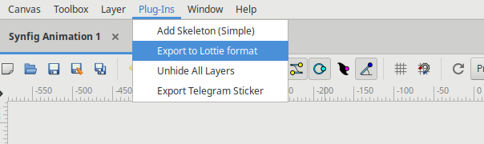
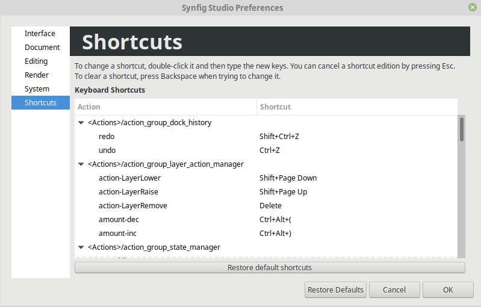
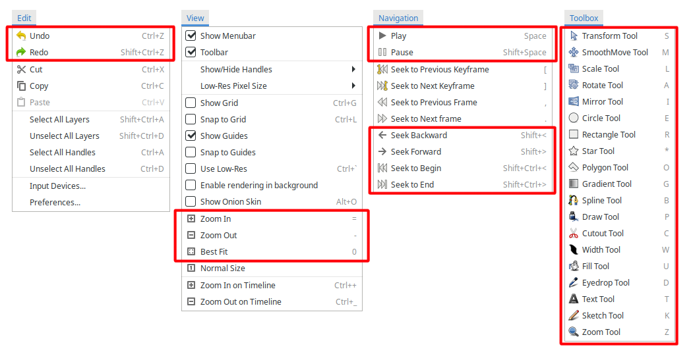

.. _release-1.4.2:

############################
Synfig 1.4.2 Release Notes
############################

Synfig Studio 1.4.2 delivers some improvements and critical bugfixes. Please read below for details.

Improved export for Web
------------------------

The `Lottie <https://airbnb.design/lottie/>`_ exporter plugin has gained new capabiilities and includes all improvements made during Google Summer of Code 2020.

|image0|

Here is what's new:

* The plugin now capable to export Advanced Outline layers (`#2199 <https://github.com/synfig/synfig/pull/2199>`_) and Blur layers (`#1505 <https://github.com/synfig/synfig/pull/1505>`_).
* Added support for converters: "Sine", "Cos", "Integer", "Linear gradient", "aTan2", "Vector angle", "Radial composite", "Radial gradient", "Vector X", "Vector Y", "Power", "Dot product", "Logarithm", "Reciprocal", "Range", "Vector length", "Not" (`#1236 <https://github.com/synfig/synfig/pull/1236>`_ `#1254 <https://github.com/synfig/synfig/pull/1254>`_ `#1286 <https://github.com/synfig/synfig/pull/1286>`_ `#1363 <https://github.com/synfig/synfig/pull/1363>`_ `#1409 <https://github.com/synfig/synfig/pull/1409>`_ `#1447 <https://github.com/synfig/synfig/pull/1447>`_ `#1446 <https://github.com/synfig/synfig/pull/1446>`_ `#1516 <https://github.com/synfig/synfig/pull/1516>`_ `#1515 <https://github.com/synfig/synfig/pull/1515>`_ `#1593 <https://github.com/synfig/synfig/pull/1593>`_ `#1586 <https://github.com/synfig/synfig/pull/1586>`_ `#1619 <https://github.com/synfig/synfig/pull/1619>`_ `#1606 <https://github.com/synfig/synfig/pull/1606>`_ `#1650 <https://github.com/synfig/synfig/pull/1650>`_ `#1587 <https://github.com/synfig/synfig/pull/1587>`_).
* Added support for variable gamma correction, fixed issue with wrong colors when exporting files (`#1174 <https://github.com/synfig/synfig/pull/1174>`_).
* Fix converter methods not working with radius of simple circle layer (`#1101 <https://github.com/synfig/synfig/pull/1101>`_).
* Improved support for exported values (`#2182 <https://github.com/synfig/synfig/pull/2182>`_).
* Use non-minified `bodymovin.js` script to avoid code obfuscation (`#2202 <https://github.com/synfig/synfig/pull/2202>`_).

Better handling of shortcuts
----------------------------

This version got brand new Keyboard Shortcut Editor dialog  (`#2160 <https://github.com/synfig/synfig/pull/2160>`_ `#2173 <https://github.com/synfig/synfig/pull/2173>`_). You can access it through "Edit" -> "Preferences" -> "Shortcuts".

|image1|

Also, some default shortcuts/hotkeys were changed for improving usability and compability with other apps like Inkscape (`#1769 <https://github.com/synfig/synfig/pull/1769>`_ `#1776 <https://github.com/synfig/synfig/pull/1776>`_ `#1811 <https://github.com/synfig/synfig/pull/1811>`_ `#1823 <https://github.com/synfig/synfig/pull/1823>`_ `#1848 <https://github.com/synfig/synfig/pull/1848>`_ `#1855 <https://github.com/synfig/synfig/pull/1855>`_ `#1953 <https://github.com/synfig/synfig/pull/1953>`_ `#2033 <https://github.com/synfig/synfig/pull/2033>`_ `#2172 <https://github.com/synfig/synfig/pull/2172>`_). 

For example, all tools shortcuts are remapped to single keys, no need to hold ``Alt`` key anymore!

|image2|

Also:

* On MacOS "Undo" and "Redo" shortcuts now use ``⌘`` (Command key) instead of Control.
* Added shortcut for toggling Animate mode (``Ctrl Spacebar``).

UI/UX improvements
------------------
* Editing parameters does not requires one extra mouse click anymore (`#1337 <https://github.com/synfig/synfig/pull/1337>`_ `#1351 <https://github.com/synfig/synfig/pull/1351>`_ `#1325 <https://github.com/synfig/synfig/pull/1325>`_).
* TimeLoop valuenode now editable via workspace (`#2066 <https://github.com/synfig/synfig/pull/2066>`_).
* LinkableValueNode now provides methods for inverse manipulation (`#2057 <https://github.com/synfig/synfig/pull/2057>`_).
* Now it is possible to close tabs by clicking with middle mouse button (`#2107 <https://github.com/synfig/synfig/pull/2107>`_ `#2120 <https://github.com/synfig/synfig/pull/2120>`_ `#2210  <https://github.com/synfig/synfig/pull/2120>`_).
* Add "Undock panel" context menu item for panel tabs (`#1929 <https://github.com/synfig/synfig/pull/1929>`_ `#2109 <https://github.com/synfig/synfig/pull/2109>`_).

Bugfixes
--------------
* Fixed incorrect background restoration on animated GIFs with transparent background (`#2134  <https://github.com/synfig/synfig/pull/2134>`_).
* Fixed crash when user drags a Group layer to a child group (`#2110 <https://github.com/synfig/synfig/issues/2110>`_ `#2116 <https://github.com/synfig/synfig/pull/2116>`_).
* Fixed crash in Spline Width and return of improper type in Spline converters (`#1890 <https://github.com/synfig/synfig/pull/1890>`_).
* Exported canvas can be reopened again after closing (`#2092 <https://github.com/synfig/synfig/pull/2092>`_).
* Fixed action "Duplicate Layer" for Skeleton Layer and their bone links (`#2059 <https://github.com/synfig/synfig/pull/2059>`_).
* Fixed action "Duplicate Layer" for Skeleton Deformation Layer and their bone links (`#2071 <https://github.com/synfig/synfig/pull/2071>`_).
* Fixed error that prevented convert to dot-product valuenode (`#1260 <https://github.com/synfig/synfig/pull/1260>`_).
* Fixed issue with saving `loop` flag in some dynamic lists (`#2165 <https://github.com/synfig/synfig/pull/2165>`_).
* Fixed SVG importer ignoring some style properties set as attributes and fixed a lot of memory leaks (`#2137 <https://github.com/synfig/synfig/pull/2137>`_).
* Fixed crash in rare cases caused by race condition when rebuilding LayerTreeStore (`#2209 <https://github.com/synfig/synfig/pull/2209>`_).
* Fixed issue when Widget_Vector do not uses locale for decimal separator (`#2102 <https://github.com/synfig/synfig/pull/2102>`_ `#2157 <https://github.com/synfig/synfig/pull/2157>`_).
* Don't show extra vertical scrollbar for Dock Sound (`#1173 <https://github.com/synfig/synfig/pull/1173>`_).
* Fix missing ``is_distance`` hint for vertex coordinates (`#2000 <https://github.com/synfig/synfig/pull/2000>`_).
* Fixed problem with missing \*.glsl files in distribution (`#1982 <https://github.com/synfig/synfig/pull/1982>`_).

