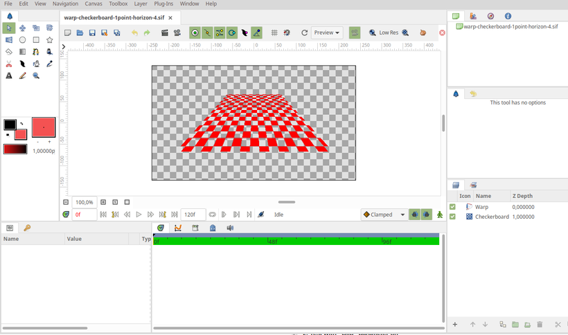
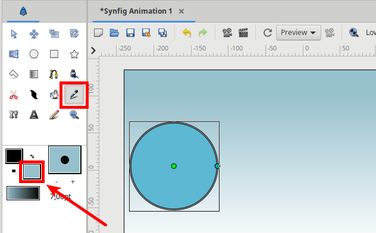

.. _release-1.5.0:

############################
Synfig 1.5.0 Release Notes
############################

Rewritten TimeTrack Panel
-------------------------

Now working with waypoints is so much easier - you can select multiple
items using \ `bounding box selection <https://github.com/synfig/synfig/issues/761>`__\ ,
duplicate and scale them, navigate to next or previous waypoints using
"n" and "b" keys (holding Shift skips 5 waypoints).

|image0|

|image1|

Also, the new Timetrack Panel now indicates \ `segments
when value of parameter remains constant <https://github.com/synfig/synfig/issues/790>`__\ .

|image2|

Improved Sound Panel
--------------------

Sound Panel now has a list of available sound layers. This way it’s much
easier to choose which waveform to show in the panel. See \ `issue
1346 <https://github.com/synfig/synfig/issues/1346>`__\  for
details.

|image3|

New Skeleton Tool 
------------------

The new intuitive Skeleton Tool allows users to easily create bones.
With this tool it is also possible to easily change the structure of
skeletons by re-parenting bones.

|image4|

.. raw:: html

  <iframe width="560" height="315" src="https://www.youtube.com/embed/8qawMmSN55o" title="YouTube video player" frameborder="0" allow="accelerometer; autoplay; clipboard-write; encrypted-media; gyroscope; picture-in-picture" allowfullscreen></iframe>   

See this documentation page to learn more about this feature -
\ `https://synfig.readthedocs.io/en/latest/tools/skeleton.html <https://synfig.readthedocs.io/en/latest/tools/skeleton.html>`__\ .

Rewritten Text Layer
--------------------

|image18|

- Text Layer fully rewritten and optimized, which results in much faster rendering (`#2362`_).
- Text Layer now have proper support for RTL languages (i.e. Arabic) (`#2232`_). Please notice that if you use a string which mixes RTL and LTR text, then you might need to set a “Direction” parameter in Text Layer to indicate the proper order.

|image19|

- Text Layers now visible when workarea displays its content in Draft mode (`#631`_).
- Fixed issue with "jumping" letters in animated text (`#389`_).
- Fixed issue with quality regression under Text Layer (`#831`_).
- Fixed glitched rendering output when Text Layer is combined with Perspective Layer (`#1566`_).
- For Text Layer it is now possible to select font family from drop-down
menu in Parameters and Tool Options
(PR \ `#1432 <https://github.com/synfig/synfig/pull/1432>`__\, `#2355`_)
- the list shows all fonts available in your system, so it is so easy to
choose one now!

|image12|

Optimized Perspective Layer
---------------------------

The Warp Layer was completely rewritten and ported to the Cobra render
engine. We also renamed it to Perspective Layer, as it sounds more
intuitive for users.

As result, the new Perspective Layer works much faster than the old Warp
Layer (see \ `detailed report about speed
tests <https://forums.synfig.org/t/please-help-with-testing-of-new-warp-layer/10687>`__\ )
and also fixes some old nasty bugs (see issues
\ `#318 <https://github.com/synfig/synfig/issues/318>`__\  and
\ `#418 <https://github.com/synfig/synfig/issues/418>`__\ ).

Some other improvements in Perspective Layer:

-  Perspective Layer is rendered with simplifications when the workarea
   uses Preview or Draft mode. This allows to achieve more than 3x speed
   increase.
-  Perspective Layer now has a new parameter - "Interpolation" - which
   allows you to optimize quality for final Render.

|image5|

Reworked Plugins Infrastructure
-------------------------------

Now anyone with knowledge of Python language can write plugins which
allows SYnfig to export/import new formats and those formats will become
available

In this version the Plugins system was
\ `improved <https://github.com/synfig/synfig/pull/1313>`__\  to
allow writing import/export functions using Python language. Now anyone
with Python knowledge can extend Synfig’s capabilities to import or
export new file formats!

Such import/export plugins are not displayed in the regular “Plugins”
menu, their functionality is available through “File -> Import” or “File
-> Export” menu commands instead.

With this change, the Lottie Exporter now called through “File ->
Export” menu.

|image6|

As another notable example, you might want to check \ `this awesome
plugin <https://forums.synfig.org/t/my-import-export-plugin-svg-telegram-sticker-lottie-dotlottie/10929>`__\ ,
which adds capabilities for import/export of SVG, Telegram Animated
Stickers (TGS) and Lottie (alternative implementation). The image below
shows a sample “tiger.svg” file imported into Synfig using this plugin.

|image7|

For more information about the improved plugins system
check \ `this
documentation
page <https://synfig.readthedocs.io/en/latest/plugins.html>`__\ .
There are also relevant discussions
\ `here <https://github.com/synfig/synfig/pull/1289>`__\  and
\ `here <https://github.com/synfig/synfig/pull/1313>`__\ .

Improvements for Import and Export
----------------------------------

Lottie Exporter now has new mode, which exports outlines without
variable widths (see
PR\ `  <https://github.com/synfig/synfig/pull/1647>`__\ `#1647 <https://github.com/synfig/synfig/pull/1647>`__\ ).
This greatly reduces the size of exported files and we advise to use it
if your animation does not have outlines with variable widths.

|image8|

Import image dialog now has "Scale to fit canvas" option (PR
\ `#1507 <https://github.com/synfig/synfig/pull/1507>`__\ ).

|image9|

"Import Sequence" function now allows to detect duplicate frames in
image sequences. In case if a duplicate frame is detected it doesn’t put
extra waypoint, which results in cleaner timeline and better
readability.

|image10|

Synfig now capable to import TSV and XML file formats, generated
by \ `Rhubarb Lip Sync <https://github.com/DanielSWolf/rhubarb-lip-sync>`__\  (see
issue \ `#2169 <https://github.com/synfig/synfig/issues/2169>`__\  for
details). It works in the same way as Papagayo Lipsync import, shown
in \ `this
video <https://www.youtube.com/watch?v%3D-Y0Ox0cnlL4>`__\ .

|image11|

AnimatedFile Converter got support for more data types - String, Angle
(degrees), Bool, Integer, Real, Time and Vector. This is useful for
cases when you have animation data (like object coordinates along time)
generated by another software and you wish to use that data in Synfig.
See
issue \ `#2211 <https://github.com/synfig/synfig/issues/2211>`__\  for
details.

Usability Improvements
----------------------

New option for Onion Skin allows to choose between Keyframes and Frames (`#2166`_).

|image20|

Now it is possible to create a new vertex on a Spline with double-click (`#2312`_).

In this version it is possible to merge/split tangents for multiple
vertices. See \ `issue
#2010 <https://github.com/synfig/synfig/issues/2010>`__\  for
details.

|image13|

Now it is possible to set the number of rendering threads from
Preferences dialog
(\ `#1999 <https://github.com/synfig/synfig/pull/1999>`__\ ).

|image14|

Eyedropper Tool now has the ability to select fill color using
Ctrl+click.

|image15|

Added possibility to stop rendering process.

|image16|

Icon themes
-----------

Now it is possible to change icon theme for Synfig Studio. Icon set
(theme) can be placed in a folder inside “share/synfig/icons/” path (eg.
share/synfig/icons/new-theme-folder) and then activated by setting the
SYNFIG\_ICON\_THEME environment variable (eg.
SYNFIG\_ICON\_THEME=new-theme-folder). See \ `PR
#1483 <https://github.com/synfig/synfig/pull/1483>`__\  for
details.

|image17|

Please notice that this is just a first step in ongoing work on
implementing theming support for Synfig Studio. You can check \ `this
discussion <https://github.com/synfig/synfig/issues/1458>`__\  for
details.

CMake build system
------------------

This version introduces the possibility to build Synfig using CMake.
Although this build method is not yet suitable for creating packages, it
greatly simplifies the build process for those who wish to compile
Synfig for development or testing purposes. Please check \ `this
documentation
page <https://synfig-docs-dev.readthedocs.io/en/latest/building/Building%2520Synfig.html>`__\  for
instructions.

.. |image1| image:: 1.6.0_dat/image18.png

.. |image11| image:: 1.6.0_dat/image1.png

.. |image14| image:: 1.6.0_dat/image11.png

.. _#2362: https://github.com/synfig/synfig/issues/2362
.. _#2232: https://github.com/synfig/synfig/issues/2232
.. _#631: https://github.com/synfig/synfig/issues/631
.. _#389: https://github.com/synfig/synfig/issues/389
.. _#831: https://github.com/synfig/synfig/issues/831
.. _#1566: https://github.com/synfig/synfig/issues/1566
.. _#2355: https://github.com/synfig/synfig/issues/2355
.. _#2166: https://github.com/synfig/synfig/issues/2166
.. _#2308: https://github.com/synfig/synfig/issues/2308
.. _#2312: https://github.com/synfig/synfig/issues/2312
.. _#2357: https://github.com/synfig/synfig/issues/2357
.. _#2289: https://github.com/synfig/synfig/issues/2289
.. _#2301: https://github.com/synfig/synfig/issues/2301
.. _#2354: https://github.com/synfig/synfig/issues/2354
.. _#2309: https://github.com/synfig/synfig/issues/2309
.. _#2329: https://github.com/synfig/synfig/issues/2329
.. _#2317: https://github.com/synfig/synfig/issues/2317
.. _#2320: https://github.com/synfig/synfig/issues/2320
.. _#2366: https://github.com/synfig/synfig/issues/2366
.. _#2350: https://github.com/synfig/synfig/issues/2350
.. _#2332: https://github.com/synfig/synfig/issues/2332
.. _#2314: https://github.com/synfig/synfig/issues/2314
.. _#2306: https://github.com/synfig/synfig/issues/2306
