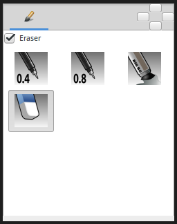

.. _tool_brush:

########################
     Brush Tool
########################

.. note::
   This feature is still in development. 

|Tool_brush_icon.png| \ **ALT-?**\ 

Introduction
------------

The ``Brush Tool`` allows you to draw freehand over the top of a `raster
image <Import_Image_Layer>`__ using the
`MyPaint <http://mypaint.intilinux.com/>`__ brushes. Combined with
`Switch Group Layer <Switch_Group_Layer>`__ you can create frame by
frame animations.

-  It is possible to paint on the `Image Layer <Import_Image_Layer>`__
-  Basic pressure sensitivity is supported.
-  Image size is automatically expanded when you paint outside of image
   boundaries.
-  An `Image Layer <Import_Image_Layer>`__ is automatically created if
   the current layer isn't an `Image Layer <Import_Image_Layer>`__.

Options
-------

   
-  Eraser check box. When checked, the brush acts as a rubber.
-  Display the set of configured brushes (MyPaint brushes format). By
   default, Synfig is installed with a selected set of brushes from
   “Concept Design (C\_D)” pack by `Ramon
   Miranda <http://www.ramonmiranda.com/2011/09/mypaint-concept-design-set-es.html>`__.
   From the `Preferences\_Dialog#System <Preferences_Dialog#System>`__,
   you can configure the ``Brush Presets Path`` to use other brushes
   package (for example the ones listed by
   `MyPaint <https://github.com/mypaint/mypaint/wiki/Brush-Packages>`__)

| The ``Brush Tool`` uses the color of the `Outline
  Color <New_Layer_Defaults#Brush_Colors>`__ and the `Brush
  Size <New_Layer_Defaults#Brush_Size>`__ set in the
  `Toolbox <Toolbox>`__ to paint.

Other sources of information
----------------------------

Here you can find a video about brush usage and frame by frame animation

`Development: Frame-by-frame animation (Part
4) <https://www.youtube.com/watch?v=Z5Bj2BzG36U>`__

.. |Tool_brush_icon.png| image:: brush_dat/Tool_brush_icon.png
   :width: 64px
