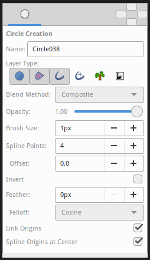

.. _tool_circle:

########################
     Circle Tool
########################

|Tool_circle_icon.png| \ **ALT-C**\ 

.. _tool_circle  Introduction:

Introduction
------------

The ``Circle Tool`` is used for creating new |Circle_Layer|. Click where you want the
|Circle_Layer_Origin| of the circle to be, and drag to set
the |Circle_Layer_Radius|.

The ``Circle tool`` can also be used to create |Outline_Layer|, |Region_Layer|, |Curve_Gradient_Layer|, and |Plant_Layer|, each with approximately circular
|Spline|.

.. _tool_circle  Options:

Options
-------

|Circle_Tool_Options.png| 

The |Tool_Options_Panel| allows you to specify:

-  **Name** : Used for the new layer; any number in this field will
   automatically increment with each layer created
-  **Layer Type** : Whether create |Star_Layer| and/or
   |Outline_Layer|, |Advanced_Outline_Layer|, |Region_Layer|,
   |Plant_Layer| and |Curve_Gradient_Layer|
   layers (Splines)
-  |Blend_Method_Parameter| : The blending method
   used to composite on the layers below
-  **Opacity** : Sets the |Amount_Parameter| for
   new layers. Defaults to **1.00** (Completely opaque)
-  **Brush Size** : Sets the |Outline_Layer_Outline_width| or the size of the gradient
   (only for |Outline_Layer|, |Advanced_Outline_Layer| and |Curve_Gradient_Layer|)
-  **Spline Points** : Specify the number of Spline Points that will be
   used in the new Splines (for other than |Circle_Layer|)
-  **Offset** : Offset of the tangent of the Spline Points (for other
   than |Circle_Layer|)
-  **Invert** : Whether invert the create(d) layer(s). Is related to his
   |Invert_Parameter|.
-  |Feather_Parameter| : Width of the area to be
   dissolved at the edge (not for |Plant_Layer| and |Curve_Gradient_Layer|)
-  **Falloff** : Determines the falloff function for the feather (only
   for |Circle_Layer|)
-  **Link Origins** : Whether Link the Offset of Splines
-  **Spline Origins at Center** : Set the origin of the layer at the
   center of the circle, else the center is set at the
   |Canvas| center

| 

.. _tool_circle  Usage:

Usage
-----

Click on the canvas where you want to have the center of the circle and
drag to obtain the desired radius value, and release the mouse button
when you are done.

.. |Tool_circle_icon.png| image:: circle_dat/Tool_circle_icon.png
   :width: 64px

.. |Circle_Layer| replace:: :ref:`Circle Layer <layer_circle>`
.. |Circle_Layer_Origin| replace:: :ref:`Circle Layer: Origin <layer_circle  Origin>`
.. |Circle_Layer_Radius| replace:: :ref:`Circle Layer: Radius <layer_circle  Radius>`
.. |Outline_Layer| replace:: :ref:`Outline Layer <layer_outline>`
.. |Region_Layer| replace:: :ref:`Region Layer <layer_region>`
.. |Curve_Gradient_Layer| replace:: :ref:`Curve Gradient Layer <layer_curve_gradient>`
.. |Plant_Layer| replace:: :ref:`Plant Layer <layer_plant>`
.. |Spline| replace:: :ref:`Spline <tool_spline>`
.. |Tool_Options_Panel| replace:: :ref:`Tool Options Panel <panel_tool_options>`
.. |Star_Layer| replace:: :ref:`Star Layer <layer_star>`
.. |Advanced_Outline_Layer| replace:: :ref:`Advanced Outline Layer <layer_advanced_outline>`
.. |Blend_Method_Parameter| replace:: :ref:`Blend Method Parameter <parameters_blend_method>`
.. |Amount_Parameter| replace:: :ref:`Amount Parameter <opacity>`
.. |Outline_Layer_Outline_width| replace:: :ref:`Outline Layer: Outline Width <layer_outline>`
.. |Invert_Parameter| replace:: :ref:`Invert <parameters_invert>`
.. |Feather_Parameter| replace:: :ref:`Feather Parameter <parameters_feather>`
.. |Canvas| replace:: :ref:`Canvas <canvas>`
