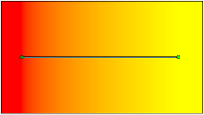
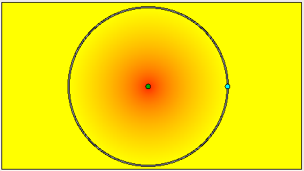
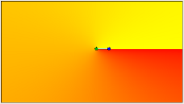
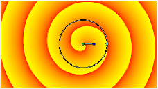

.. _tool_gradient:

########################
  Gradient Tool
########################

|Tool_gradient_icon.png| \ **ALT-G**\ 

Introduction
------------

The ``Gradient Tool`` is used to create smooth transitions between two
or more colors in an object.

Options
-------
|Gradient_Tool_Options.png|

When you select the Gradient Tool, the `Tool Options Panel <Tool_Options_Panel>`__
will show the options for the Gradient Tool.

These allow you to:

-  **Name** : Set a name for the layer you are about to create. The name
   of the layer can always be changed later via the `Layers
   Panel <Layers_Panel>`__ or the `Parameters
   Panel <Parameters_Panel>`__ if necessary, but the type of gradient
   needs to be chosen now.
-  **Layer Type** : Choose the type of gradient to create (Linear,
   Radial, Conical, Spiral).
-  `Blend Method <Blend_Method_Parameter>`__ : The blending method
   used to composite on the layers below
-  **Opacity** : Sets the `Amount Parameter <Amount_Parameter>`__ for
   new layers. Defaults to **1.00** (Completely opaque)

| For help with editing gradient colors see the section on `Gradient
  Editor Dialog <Gradient_Editor_Dialog>`__.

.. |Gradient_Tool_Options.png| image:: gradient_dat/Gradient_Tool_Options.png

The 4 types of gradients
------------------------

`Linear <Linear_Gradient_Layer>`__

|Linear_gradient.png|

This produces a simple transition in a straight line. Set your
foreground and background colors. Click where you want the 
gradient to begin, and drag to where you want the transition 
to end. The gradient will be created perpendicular to the line 
you drag out. At any time, you can edit the gradient by moving 
either endpoint in any direction. You must use the 
`Transform Tool <Transform_Tool>`__ to be able to edit the 
endpoints.

`Radial <Radial_Gradient_Layer>`__

|Radial_gradient.png|

This produces circular colors with the transition being at the 
center of those circles. Click where you want the center of the 
circles to be, and drag to set the radius of the transition. Use 
the `Transform Tool <Transform_Tool>`__ to edit the position 
(center endpoint), or the radius (surface endpoint), of the 
radial gradient.

`Conical <Conical_Gradient_Layer>`__

|Conical_gradient.png|

This has the appearance of looking down on a tip of a cone. 
The gradient is along the circular arc of the center and goes in 
all directions. Click to set the center, and drag to indicate the 
direction in which the foreground and background colors should go. 
To edit afterwards, use the `Transform Tool <Transform_Tool>`__. 
The center endpoint can be adjusted to move the center of the 
gradient. The other endpoint adjusts the direction of the gradient.

`Spiral <Spiral_Gradient_Layer>`__

|Spiral_gradient.png|

This produces a spiral gradient. Click to set the center of the 
spiral and drag to set the 'tightness'. To edit afterwards, use the 
`Transform Tool <Transform_Tool>`__.

Documentation writers note: You can download the project to generate the screenshot:  
:download:`Gradient_options.zip <gradient_dat/Gradient_options.zip>`

