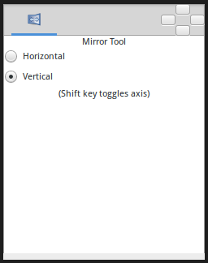

.. _tool_mirror:

########################
     Mirror Tool
########################
|Tool_mirror.png| \ **ALT-M**\ 

Introduction
------------

The Mirror Tool will mirror all the selected `handles <Handle>`__ about
a horizontal or vertical axis passing through the mouse cursor.

Options
-------

   
-  **Horizontal** : Horizontal axis mirror.
-  **Vertical** : Vertical axis mirror.

| 

Usage
-----

For example, to mirror a spline horizontally:

-  select the Mirror Tool, either by clicking in the
   `toolbox <Toolbox>`__ or hitting ``Alt+m``
-  check ``Horizontal`` in the `Tool Options
   Panel <Tool_Options_Panel>`__
-  select the Spline Layer
-  select all handles in the spline by hitting ``Ctrl+a``
-  drag one of the selected handles a little

As soon as you start dragging, the handles will all flip about a
vertical axis passing through the duck you're dragging. You will be able
to drag the handles around, but the motion will be constrained to only
move left and right.

