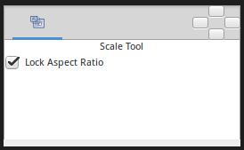

.. _tool_scale:

########################
     Scale Tool
########################

|Tool_scale.png| \ **ALT-S**\ 

Introduction
------------

The ``Scale Tool`` permit to scale the selected handles. It works much
like to `Transform Tool <Transform_Tool>`__ except for when multiple
`Handles <Handle>`__ are selected.

Options
-------

|Scale_Tool_Options.png| 

The `Tool Options
Panel <Tool_Options_Panel>`__ allows you to specify:

-  **Lock Aspect Ratio** : Prevent from changing the ratio x:y of the
   bounding box of the selected Handles.

Usage
-----

`Select multiple Handles <Handle#Choose_your_handles>`__, by either:

-  Pressing ``Ctrl+A`` to select all Handles.
-  Dragging a rectangle around a group of Handles.
-  Holding the ``Control`` key while clicking Handles to toggle their
   selected status.

Then drag one of the selected Handles. All the selected Handles will be
scaled relative to the center of the selected group.

When scaling a selection don't drag a Handle that its position is close
to the X or Y center of the bounding box. Select a Handle that is close
to one of the corners of the bounding box. If you drag from a Handle
that have a X or Y coordinate that is the same than the center of the
bounding box it would produce an infinite scale factor and a very
difficult to control scaled shape. (The Handles that aren't over the
bounding box X or Y center are scaled by a huge factor). This is a
behavior that should be corrected (for example giving to the user corner
pulling anchors to allow make a correct scaling).

