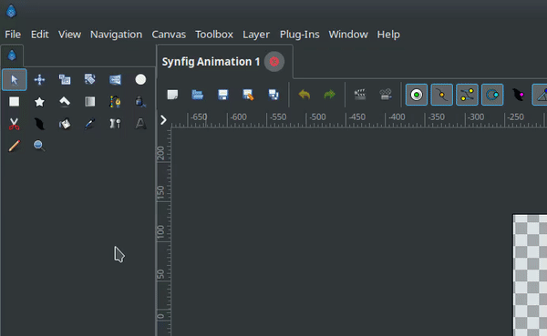
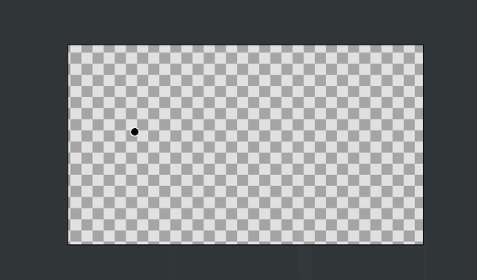
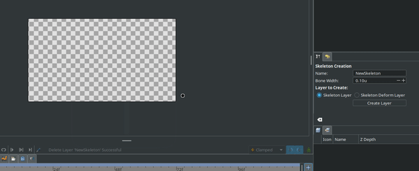
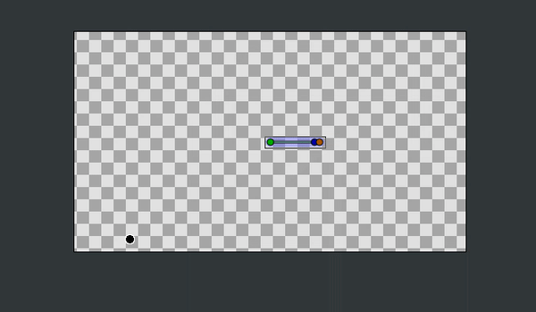
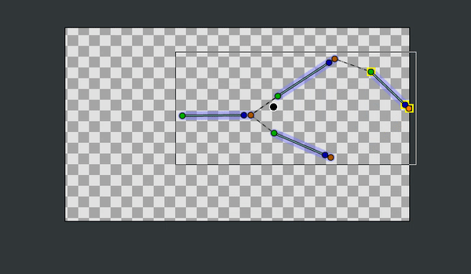
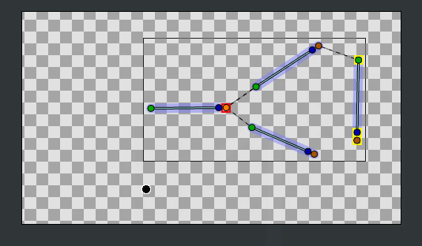
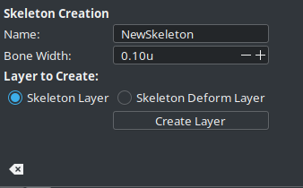

.. _tool_skeleton:

########################
    Skeleton Tool
########################

Introduction
============

Synfig also supports animating objects using bones and the Skeleton tool makes it easy to build skeletons of Bones.

Usage
=====

Select "Skeleton Tool" in the Toolbox Panel or use the keyboard shortcut <Alt><o> to enable it. To leave the tool, you can just select another tool from the toolbox.

There are two types of layers in Synfig that are built with bones: Skeleton Layer and Skeleton deformation layer. We can build any of these layers.

You can create a bone by either

* **Click-release at a position:** This will create a bone with default length and angle but with the width value as set in the tool options menu. (The tip and origin width of the bone will be same) or,
* **Click-drag-release between two positions:** This will create a bone between the points you dragged between with the width value as set in the tool options menu. (The tip and origin width of the bone will be same)

If you try to use this tool when the selected layer is not any of the bone layers, a new layer is created with the bone added. The layer that is to be created can be set in the tool options menu. You can always create an empty bone layer using the "Create Layer" button in the tool options menu.

The parent child relationships of bones are represented by a dashed line from parent's tip to the child's origin. 

When you click on a bone, the bone is set as the **"Active Bone"**. Active bone is highlighted with a yellow outline. Any bone that's created is added as a child to the active bone. When there is no active bone set, then the bone created after will have no parent.

The handles of the bone will have same meaning as they had before. A point to be noted is that, you can even click on a Handle to set a bone as "Active Bone". When you use a handle to modify a bone, note that the bone is set as the "Active Bone".

The parent-child relationships of bones can be changed by using the **"Make parent to active bone"** option in the context menu of any bone handle.

When you are modifying a skeleton deformation layer using the Skeleton tool, it is to be noted that

* The layer gets disabled.
* Width handles are turned on.
* Any changes you make to the rest position effects the deformation too.

Options
=======

You can find the following options in the tool options menu:

* **Name:** The name of the layer that will be created.
* **Bone Width:** The width of the bone that will be created next.
* **Layer to Create:** The layer type that will be created.

