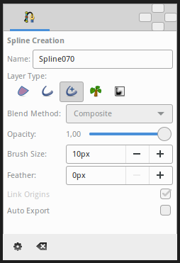

.. _tool_spline:

########################
    Spline Tool
########################

|spline_dat/Tool_bline_icon.png| \ **ALT-B**\ 

Introduction
------------

`Splines <Spline>`__ are the most used objects in any normal animation
done with Synfig, and the Spline Tool allows you to create them.

Usage
-----

Select the ``Spline Tool`` in the or use keyboard the shortcut ``Alt+b``
to enable it. To leave that mode just select another from the
`toolbox <Toolbox>`__.

It is easy to use this tool
~~~~~~~~~~~~~~~~~~~~~~~~~~~

-  Each single click creates a new ``Vertex``. Its ``Tangent`` values
   are set to (0,0) and the ``Vertex`` becomes a sharp corner.
-  Click and drag creates a new ``Vertex`` and allows the modification
   of the ``Tangent`` value at that ``Vertex``. Extending the
   ``Tangent`` smooths the corners.
-  Each new ``Vertex`` is attached to the previous by a
   ``Bézier Spline`` defined by the vertices' position and tangents.
-  The ``Spline`` is created sequentially, one ``Vertex`` follows the
   previous one.
-  The end point of the previous ``Spline`` arc guides the next arc
   created until you close it. The next created ``Spline`` will be
   independent of the previously created one.
-  You can tweak the newly created Vertices by clicking on their
   `handles <Handle>`__ and dragging them.
-  You can also right click on a ``Vertex`` handle or a ``Tangent``
   handle and it will provide a context menu:

   -  For ``Tangent`` handles: ``Split Tangent's Angle`` and
      ``Split Tangent's Radius`` will split the ``Tangent`` so that you
      can independently modify the arch of an end point of a Bézier
      curve. On the opposite, ``Merge Tangent's Angle`` and
      ``Merge Tangent's Radius`` will merge the independent ``Tangents``
      so that you can align the arches of the end points of two
      connecting Bézier curves.
   -  For ``Vertex`` handles: ``Loop Spline`` or ``Unloop Spline``
      (depending if already looped or not) allows you to close or open
      the ``Spline``. ``Delete Vertex`` allows you to delete the
      ``Vertex``.

-  You can also right click in the middle of a Bézier curve.
   ``Insert Vertex`` allows the insertion of a ``Vertex`` (and sets its
   Tangents intelligently according to the neighboring Vertices) where
   you clicked.

To finish the Spline
~~~~~~~~~~~~~~~~~~~~

#. Select another tool in the .
#. Or click on the gear button |Gear_icon.png| of the `Tool Options
   Panel <Tool_Options_Panel>`__.

To clear out the working Spline, press the ``Esc`` button.

Category:Toolbox

Options
-------

|Spline_Tool_Options.png| 

This tool has the following options:

-  **Name**: Sets the name of the Spline that you will create, in this
   case “Spline070”. If the ending part of the string contains an
   integer number, this input text box will parse it and increase that
   number for the next created Spline. Otherwise, it will add a three
   digit number while creating the next one.
-  **Layer Type**: Sets whether to create `Region <Region_Layer>`__,
   `Outline <Outline_Layer>`__, `Advanced
   Outline <Advanced_Outline_Layer>`__, `Plant <Plant_Layer>`__ and/or
   `Curve Gradient <Curve_Gradient_Layer>`__ Layers.
-  `Blend Method <Blend_Method_Parameter>`__: Sets the blending
   method used to composite on the layers below.
-  **Opacity**: Sets the `Amount Parameter <Amount_Parameter>`__ for new
   layers. Defaults to **1.00** (Completely opaque).
-  **Brush Size**: Sets the size of the line for `Outline
   Layer <Outline_Layer>`__ and/or `Advanced Outline
   Layer <Advanced_Outline_Layer>`__.
-  **Feather**: Sets the `feather parameter <Feather_Parameter>`__ of
   the `Region <Region_Layer>`__ or Outline Layer created.
-  **Link Origin**: If checked, links the `Origin
   Parameter <Origin_Parameter>`__ for the `Plant <Plant_Layer>`__,
   `Region <Region_Layer>`__ or Outline if two of them (or all them) are
   checked.
-  **Auto Export**: If checked, exports automatically the `Vertices
   parameter <Vertices_Parameter>`__ (that's a `Spline <Spline>`__ type
   parameter)

| 

Other sources of information
----------------------------

See this `video tutorial <Video_Tutorials>`__ to see it in action.

Read `Doc:Creating Shapes <Doc:Creating_Shapes>`__ which talks a little
about the Spline tool.

Read Dev:Spline_Bline about tangent internals computation.

Read Dev:Bline_Speed which explains about variations in the Amount
parameter of Splines.

Category:Toolbox `tool <Category:Tools>`__ Category:Toolbox

.. |Bline\_icon.png| image:: Bline_icon.png
   :width: 64px
.. |Gear\_icon.png| image:: Gear_icon.png

