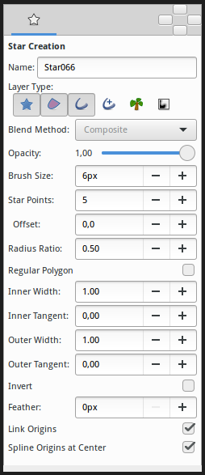

.. _tool_star:

########################
    Star Tool
########################

The Star Tool allows the easy creation of `Star Layers <Star_Layer>`__.

Select the Star Tool icon from the `toolbox <Toolbox>`__, then click in
the `canvas window <Canvas>`__ where the center of the star should be
created and drag to specify the outer radius.

Options
-------

|Star_Tool_Options.png|

The `Tool\_Options\_Panel <Tool_Options_Panel>`__ allows you to specify:

-  **Name** : The name used for the new layer; any number in this field
   will automatically increment with each layer created
-  **Layer Type** : Whether create `Star Layer <Star_Layer>`__ and/or
   `Outline <Outline_Layer>`__, `Region <Region_Layer>`__,
   `Plant <Plant_Layer>`__ and `Curve Gradient <Curve_Gradient_Layer>`__
   layers (Splines)
-  `Blend Method <Blend_Method_Parameter>`__: How to combine the
   new layer with the background.
-  **Opacity** : Sets the `Amount Parameter <Amount_Parameter>`__ for
   new layers. Defaults to **1.00** (Completely opaque)
-  **Brush Size** : Sets the `Outline
   width <Outline_Layer#Outline_width>`__ or the size of the gradient
   (only for `Outline <Outline_Layer>`__, `Advanced
   Outline <Advanced_Outline_Layer>`__ and `Curve
   Gradient <Curve_Gradient_Layer>`__)
-  **Star Points** : The number of peaks of the star.
-  **Offset** : The rotation offset of the created star.
-  **Radius Ratio** : The ratio between the peaks and the troughs of the
   star
-  **Regular Polygon** : Whether create a regular polygon instead of a
   star.
-  For Splines only, the tangent lengths for outer and inner vertices.
   Outer is limited to [-3,10] and inner is limited to [-3,3]. (*If you
   find useful open those limitations please write it in the talk page*)

   -  **Inner Width**
   -  **Inner Tangent**
   -  **Outer Width**
   -  **Outer Tangent**

-  **Invert** : Whether invert the create(d) layer(s)
-  `Feather <Feather_Parameter>`__ : Width of the area to be
   dissolved at the edge (not for `Plant <Plant_Layer>`__ and `Curve
   Gradient <Curve_Gradient_Layer>`__)
-  **Link Origins** : Whether Link the `Origin
   Parameter <Origin_Parameter>`__ of Splines
-  **Spline Origins at Center** : Set the `Origin
   Parameter <Origin_Parameter>`__ of the layer at the center of the
   star, else the center is set at the `Canvas <Canvas>`__ center

| 

