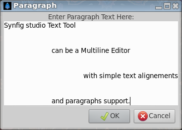

.. _tool_text:

########################
     Text Tool
########################
|Tool_text_icon.png| \ **ALT-X**\ 

Select the ``Text Tool`` icon from the |Toolbox|, then click
in the |Canvas| where the |Text_Layer|
should be created.

A dialog box will appear, allowing you to enter the text you want in the
created layer. Enter the text, click ``OK`` button, and a new Text Layer
will be created. In the dialog box, if ``Multiline Editor`` is checked,
``Enter`` will add a new line, you can hit ``Ctrl|Tab`` to give focus to
``OK`` button to validate.

.. _tool_text  Options:

Options
-------

The |Tool_Options_Panel| allows you to specify:

-  the **Name** used for the new layer; any number in this field will
   automatically increment with each layer created.

-  ``Multiline Editor`` - whether to use a single or multi-line editor
   for entering the text. If a single line is used then the ``Enter``
   key will submit the value. In the multi-line editor, you'll need to
   click the ``OK`` button with the mouse to confirm the text or hit
   ``Ctrl|Tab`` to give focus to ``OK`` button.

-  ``Size`` **X** **Y** - the horizontal and vertical size of the text.

-  ``Orientation`` **X** **Y** - the orientation of the text. The
   default (**0.5**, **0.5**) means that the text will be centered
   around the point you clicked on. (**0**, **0**) means that the top
   left corner of a box containing the text will be placed where you
   clicked. (**1**, **1**) means that the bottom right corner of the
   text's bounding box will be placed where you clicked.

-  ``Family`` - the font family to be used.

