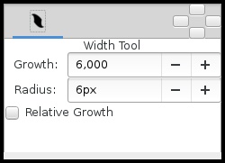

.. _tool_width:

########################
     Width Tool
########################
|Tool_width_icon.png| \ **ALT-W**\ 

.. _tool_width  Introductions:

Introductions
-------------

The Width Tool is designed for increasing or decreasing the width of a
line much like you would with a pencil on paper.

.. _tool_width  Usage:

Usage
-----

To change the width on a particular segment of a line, just select the
|Outline_Layer| you want, move your mouse over that
line, press the left mouse button and move cursor back and forth along
the line, like you're scratching something. The width of outline will be
increased at the places where you moved the cursor. If you want to
decrease the width, just hold ``Ctrl`` while scratching.

The Width Tool was primarily designed for the “tablet” workflow, so you
will get the best experience by using it with the tablet stylus. It is
similar to making line thicker with a pencil or thinner with an eraser
(when holding the ``Ctrl``).

.. note::
   The Width Tool is intended to fine-tune line width. If you want to heavily
   increase/decrease the line width it’s better to use the 
   |Transform_Tool| to directly 
   manipulate the width |Handle|.

.. _tool_width  Options:

Options
-------

   
-  **Growth** - Defines how much a single mouse move will affect the
   line width. It must be non-zero for this tool to have an effect on
   the spline.
-  **Radius** - Defines the size of area around current cursor position
   in which a vertex will be affected. It is allows you to achieve a
   noticeable effect without having to follow the line precisely with
   the mouse. The Width Tool works fine on splines with lots of segments
   (such as those created with the |Draw_Tool|), you will
   see it works on more than just the first vertex. It is a full
   circular area, other points may get in the way though.
-  **Relative Growth** - Doesn't really work very well unless the
   ``Radius`` parameter is set to some huge value (like a million).

| 

.. _tool_width  Nota:

Nota
----

If you don't want the ``Width Handle``\ s to be displayed, while using
the Width Tool, just turn them off by pressing ``Alt+5``. You can turn
them on again with the same keybinding.

.. |Tool_width_icon.png| image:: width_dat/Tool_width_icon.png
   :width: 64px

.. |Outline_Layer| replace:: :ref:`Outline Layer <layer_outline>`
.. |Transform_Tool| replace:: :ref:`Transform Tool <tool_trasnform>`
.. |Handle| replace:: :ref:`Handle <handles>`
.. |Draw_Tool| replace:: :ref:`Draw Tool <tool_draw>`
