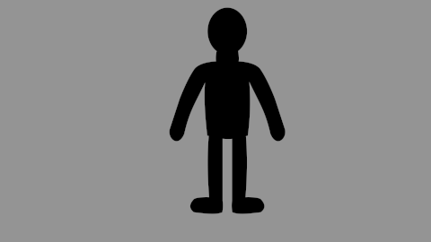
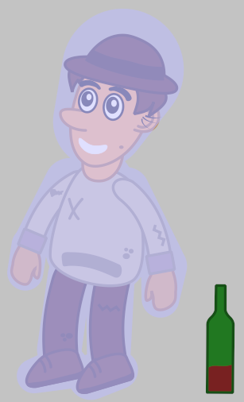

.. _tutorial__bones_morphing:

#################################
   Basic Bone Morphing
#################################

.. _tutorial__bones_morphing  Example1 (easy understanding):

Example1 (easy understanding)
=============================

In this tutorial, we will learn how to move a character with the
“Morphing by bones” we arrive at this result:

   A puppet animation.
   
 
.. _tutorial__bones_morphing  Preparation:

Preparation
-----------

First, we need to create a character in 1 piece, then create a skeleton
in a well defined order, to avoid that everything does twist at the same
time during the animation.

Once your “puppet” in the ``Canvas`` It must be added a skeleton. To add
a skeleton layer, ``New layer`` → ``Other`` → ``Skeleton``

   Place the layer skeleton next to the puppet.

Here is a shema which shows the order in which you must create each
bone:

   Schema numbered to place the bones.  
 
First 1 then use the bone of 1 to create the 2 etc...

To create the 5 bone, use the 2 bone, the arrows represent what “bone”
must be used to create the new “bone”. To create the 7 bone, use the 
bone 1, and 8 use the bone 1.

After you create the 1st bone (the head) click:
``Switch handles widths`` 

   Button: Switch handles widths.

This will show you the widths of handles, it remains only to completely
cover your puppet with each “bone” use the “Purple handle” to change the
diameter of the width.

The rest you already know the “orange/brown” allows the lengthening of
the segment (bone). the “blue” handle this is for orientation (corner
handle) from the origin with a determined length, “green” This is the
original/axis of rotation (handle position) to move the whole bone.

Once your first “bone” covers the entire head and neck, right-click on
the skeleton and ``Create a child bone`` place him then on your puppet
the shema will help you have a correct order (for the animation then).

Once finished and that your puppet is covered with bones, you have this:

   Puppet covered with bones.

.. _tutorial__bones_morphing  Linking bones to members:

Linking bones to members
------------------------

Then select your puppet, in the ``Layers panel`` and then make a
``Ctrl|A`` in the canvas to select all vertices.

Then selected the layer ``skeleton`` We have create earlier, making
``Ctrl|Clic``, in the layers panel. In the ``canvas`` now right-click on
one of the handles of the skeleton and make ``Link to the skeleton``.

You just have to create your animation.

.. _tutorial__bones_morphing  Project file:

Project file
------------

The zip file containing parts of this tutorial may be found here:
:download:`Skeleton-puppet <bones_morphing_dat/Skeleton-puppet.zip>`

.. _tutorial__bones_morphing  See also:

See also
--------

Here's a video using the same technique on a character dispute:
`Development: Bones (part7) <https://www.youtube.com/watch?v=NbI6TeAHbgs>`__

.. _tutorial__bones_morphing  Example 2 (more detailed understanding):

Example 2 (more detailed understanding)
=======================================

Now that you know:

-  The button “Toggle the width handles.”
-  The order of “creation of bones”.
-  The Handles.
-  Linked, a bone to a limb.

We will do it on a more complex man, the method being simpler because we
designate “each limb” in “linking the bone to the skeleton” gradually as
(1 to 1), and we verify that the link is made.

   Here is our man once animated.

Let's start by seeing which limbs should be grouped, as in this image:

   Limbs are separated.

Then import your limbs, group layers, like this: 

   Arrange layers by group.

Once properly classified, this will go very fast, let's do it again as
we saw on the “black man”, but the only difference so, is that we will
link to the skeleton each limb and check that it works before moving to
the next.

As we already know the method, this will be very simple. Add a skeleton
and place it at the top of our group, after positioning it on the head
and the hat.

Then click on the group “head” in the “Layers panel” right click and
“Select All Layers Kids” we must also select our “hat” here we will make
rather a ``Ctrl|click`` once the layers of “hat and head” to select,
let's move on.

``Ctrl|A`` (to select the vertices) selecting in the “Layers panel” the
skeleton. In the “canvas” now right click on one of the skeleton handles
and do “Link to the Skeleton”. (You see that the color of the handles
changes) this means that the link is created.

To check our link, select only the skeleton, and move the “blue handle”,
the head and hat should come with your skeleton.

Well now you have to cancel, make a ``Ctrl|Z`` or “edition > cancel”,
(Don't press too many times otherwise your connection to the skeleton
will have to be started again).

Now, you just do the same thing to, for all other members 1 by 1.

Let's repeat it one last time for the “neck”.

First we need to extend “bone” so in the canvas we make a right click
and “Create a Child Bone” positionner-le pour prendre le cou.

Click on the group “neck” in the “Layers panel” right click and “Select
All Layers Kids” ``Ctrl|A`` (to select the vertices) selecting in the
“Layers panel” the skeleton. In the “canvas” now make a right-click on
one of the handles of the skeleton in the “neck” and made “Link to the
Skeleton”. (you can see that the color of the handles changes) this
means that the link is created.

We check the link “nake” and also “head”, (if a part of the vertices
twists oddly, replace the bone and repeat the binding, if it is really
impossible to correct, must then be “Link to the bone”). After checking
that it works, we cancel, with the shortcut, or yellow arrow (cancel),
green arrow (redo).

Then you just have to do everything else helping you with the scheme of
the “black man”.

Once the “bone” add and “Bind to the skeleton or Bind to the bone” you
will have something like this:

   

All you have to do is animate your man.

.. _tutorial__bones_morphing  “Linked to the skeleton” OR “linked to the bone”:

“Linked to the skeleton” OR “linked to the bone”
------------------------------------------------

On the left image, you see a link made on: “Linked to the skeleton”, the
limb will twist according to where it will be on your man.

On the right image, you see a link made on: “linked to the bone”, the
limb will remain straight as a piece of wood.

   

  
A cartoon character, will appear more alive with a few “Links to the
skeleton”. So use the one that best fits the end use.

.. _tutorial__bones_morphing  Important:

Important
---------

Significant accuracy on the binding of a limb.

Example for a leg that is composed of 3 parts:

Create a bone for the foot, link, check. For the calf, link, check. For
the thigh, link, check. (They are all to be done separately).

.. _tutorial__bones_morphing  Project File:

Project File
------------

The zip file containing the parts of this tutorial can be found here:
:download:`Man-vagabon-archive.zipz <bones_morphing_dat/Man-vagabon-archive.zip>`

.. _tutorial__bones_morphing  Example 3 - Skeleton for Walking:

Example 3 - Skeleton for Walking
================================

Here is a schema of “skeleton” that was made to “walk”, this skeleton
was built especially for this function.

   Schema for walking.

There are 3 skeletons, that of the left leg, right leg, trunk.

A “hook” is a primary bone that prevents the skeleton from sliding
unintentionally during animation.

Here the 3 hooks are located at the position 1,5,9 there are dotted.

To start creating our skeleton it is necessary, create the bone “1”, it
will be the hook, then create a child bone, move it to “2”, then
continue until 4.

As for the 2nd skeleton, place the “hook” bone “5”, place your bone in
the same direction that the limb.

Here the shoe has the same angle that “bone”.

We pass to the skeleton 3, we create the bone “9” which will be the
“hook”, then once the bone 10 is placed, we create the child bone 11
until the 13th, we create the child bone 14 from the 10th until the
16th.

And we end up creating the child bone 17 from the 10th.

To summarize the bone 10, is the bone that must be selected to create
the child bones 11,14,17.

**The advantage of this skeleton is that the feet will not slip
“unintentionally” during the animation, this is why it is better to use
this type of skeleton if you want to move the lower body.**

.. _tutorial__bones_morphing  Project File:

Project File
------------

The zip file containing the parts of this tutorial can be found here:
:download:`Skeleton-to-walk-archive.zip <bones_morphing_dat/Skeleton-to-walk-archive.zip>`

.. _tutorial__bones_morphing  Example 4 - Skeleton general (default):

Example 4 - Skeleton general (default)
======================================

Here is the schema of a general “skeleton” that at the moment is the
best if you want to do something other than walk, so there is only 1
skeleton.

The only difference with the “schema of the black man” and that he can
move the head and that the center of gravity is in the bone “1” green
handle.

The main disadvantage is at the level of the feet, having no hook in
this place, the feet will certainly move during the animation.

If you want to do a specific action, then it will be easier to create a
skeleton adapted to the desired action.

   Schema of a basic skeleton.

There is only 1 skeleton, including 1 “hook” it starts to bone “1”, the
green position handle, which is surrounded by pink is the handle that is
to use to move the whole character.

Then we create only “bones children”: we must use the schema to create
the bones in the right direction.

.. _tutorial__bones_morphing  Project File:

Project File
------------

The zip file containing the parts of this tutorial can be found here:
:download:`Skeleton-general-archive.zip <bones_morphing_dat/Skeleton-general-archive.zip>`

.. |A puppet animation.| image:: Skeleton-puppet-animation.gif
.. |Schema numbered to place the bones.| image:: Skeleton-puppet-shema1.jpg 
.. |Button: Switch handles widths.| image:: Skeleton-method2b.png
.. |Puppet covered with bones.| image:: Skeleton-puppet-shema2.jpg
.. |Limbs are separated.| image:: Man-vagabon-cut.png
.. |Arrange layers by group.| image:: Man-vagabon-layers.png
.. |Man-vagabon-skeleton01.png| image:: Man-vagabon-skeleton01.png
.. |Man-vagabon-skeleton02.png| image:: Man-vagabon-skeleton02.png

