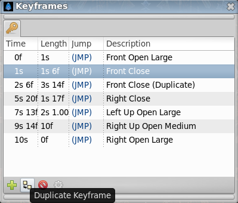
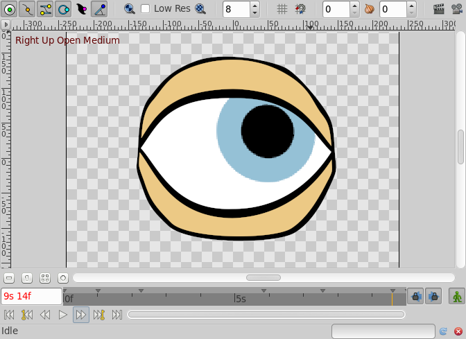
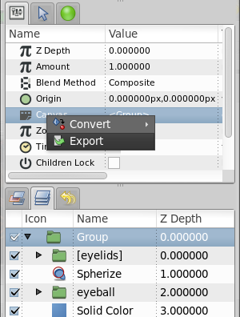
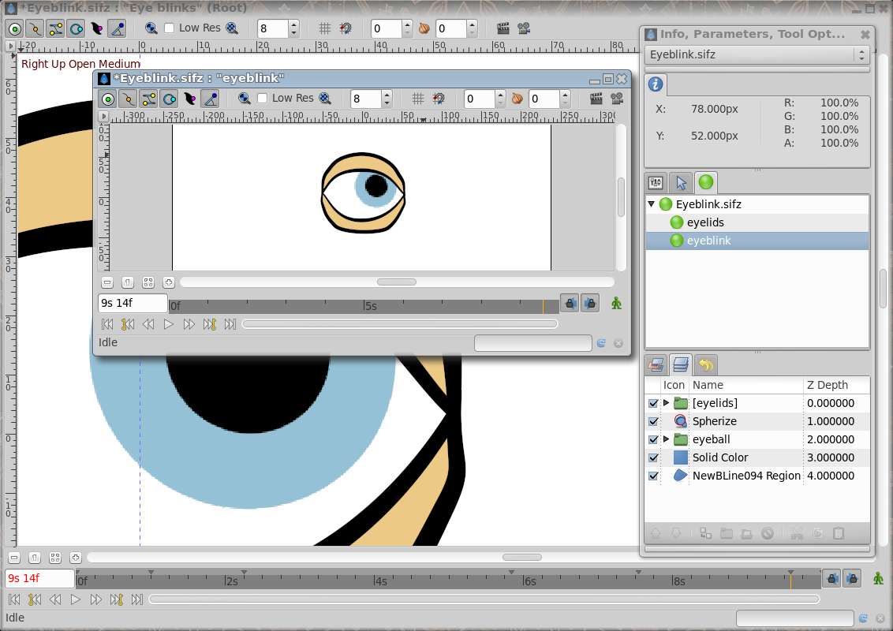

.. _reuse_animations:

########################################
    Reuse Animations
########################################

.. _reuse_animations  Introduction:

Introduction
------------

One of the goals of all animators (especially the lazy ones like me) is
to have the opportunity to reuse pieces of animation. It allows you to
save a lot of time if you can insert some portions of animations already
recorded into any other position in time.

This is especially useful for making characters speak because you have
to move your character's mouth to repeated positions depending on the
phonemes it describes while speaking.

This can be done easily just using a combination of
|Keyframe| and exported canvases.

.. _reuse_animations  Keyframes:

Keyframes
---------

Our goal is to record some sort of animation and reuse it later. This
can be done using keyframes. If you create some keyframes at the
beginning of your animation you can reuse these “poses” at a later point
in time just by duplicating the keyframes at another time position. To
do that just do following:

#. Create a Keyframe at a frame (all of our keyframes should be created
   close to each other to use a small portion of time. We only want to
   record a “pose” not a transition).
#. Modify your objects in the way you want (for example make an eye
   close just by moving the points of the eyelid).
#. Give a name to the keyframe just by clicking on its corresponding
   Description cell.
#. Repeat the above steps as many times you need to make a new “pose”.
   Let's say you have created a keyframe at frames number 2 (eye open)
   and 4 (eye closed).
#. Once done then go to another frame with the |Time_Cursor|, select the keyframe you want to introduce
   and press the “Duplicate keyframe” button. You'll obtain a copy of
   the selected keyframe at the current |Time_Cursor|
   position.

There is a problem with this technique. You are making copies of the
entire animation poses that you have stored in the first keyframes of
the time (frames 2 and 4 of the sample) and therefore you have made
copies of all the other objects existing in the scene (following the
example, the eyeball).

If you already have an eyeball animation recorded and you overlap an
eyeblink (open and closed) set of keyframes in the middle, then the
eyeball animation would be broken by the insertion of the copies of the
eyelid movement keyframes.

.. _reuse_animations  Exporting the Canvas Parameter:

Exporting the Canvas Parameter
------------------------------

Every time you group the layers, you obtain a |Group_Layer| that prevents the composition of the contained
layers over layers outside of it.

One of the parameters of the Group Layer is the |Canvas|. The
canvas is like a workspace that represents all the grouped layers.

 
To avoid the problem described in the previous section (the keyframes
affecting all the objects in the scene) you can do following:

#. Before creating the keyframe poses of the eyelids, group all the
   layers that form the eyelids.
#. Select the Group layer and select the Canvas parameter in the
   Parameter Dialog.
#. Right click the Canvas parameter, export it, and give it a name (in
   the sample this will be “eyelids”).

Go to the |Canvas_Browser_Panel| and select the
just exported canvas.

Double click it and a new workarea window will open with just the layers
that were grouped at the step 1 - the “eyelids” canvas in the sample.

 
Create all the keyframes you need to store your “poses”. Once done go to
the proper frame and insert a copy of the pose keyframe. It will produce
a keyframe in the “eyelids” canvas, but will not produce any keyframe on
the other layers (for example the eyeball). This allows to independently
animate of a portion of the model separated from the rest. Be sure that
the exported canvas is as long as the animation.

Now once you have stored the eye blinks (open and closed) at the desired
position you can go to the main window (just close the “eyelids” canvas
work area). You'll see that all the modifications have been transmitted
to the main animation but they haven't created any keyframes in the main
work area. Even the layers that are inside the “eyelids” Group layer
don't have any keyframes (you can see an indication that there are
keyframes in the exported canvas - dashed vertical lines - but no
keyframe is displayed in the keyframe dialog). Anyway, you can see the
waypoints created by the keyframes and tweak them, but not the keyframes
themselves. To modify the keyframes you should edit the exported canvas
again in its own work area. If you modify the grouped layers from the
main work area, waypoints will be created according to the main work
area keyframes, not the exported canvas work area, so you will get
different effects depending upon which work area you use to modify the
grouped layers.

Now, once you have created your animation of the eyelids you can go to
the eyeball and modify it to your taste, inserting keyframes or
waypoints with no worries about interfering with the eyelid animation.
Also you can animate the eyeball before and make the animation of the
eyelids later. They won't interfere with each other.

It would be a great improvement if you could connect the time cursors of
the main work area and the exported canvas work area to show both
windows at the same current time. This would give feedback on where to
insert the 'pose' keyframes in your local animation.

.. _reuse_animations  A sample:

A sample
--------

Here you can find a sample animation of a blinking eye (the closed and
open positions are copies of the keyframes “Open” and “Closed”, while
the eyeball moves independently in its own animation.

I have stored the poses “Open” and “Closed” at frames 0 and 2. The
animation is defined to start at frame 6.

:download:`Sample file <reuse_animations_dat/Eyeblink.sifz>`

All comments are welcome.

