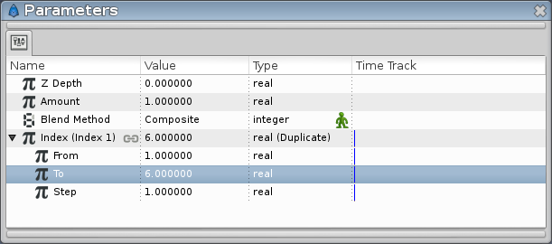

.. _tutorial_snowflake:

########################################
    Snowflake with the Duplicate Layer
########################################

**This tutorial explain a simple example of the use of the `Duplicate
Layer <Duplicate_Layer>`__, to create a snowflake.**

First branch of the snowflake
-----------------------------

The 1st part is very simple : We'll create a single snowflake branch
with the `Spline Tool <Spline_Tool>`__ (or the `Polygon
Tool <Polygon_Tool>`__).

Select the ``Spline tool``, and in the tools options, make sure that
only ``Create Region`` is checked. (If you use the ``Polygon tool``,
check either ``Create Polygon Layer`` or ``Create Region``, as you
wish).

Draw the branch in the upper middle part of your image. Once it's drawn,
select the newly created layer (I will refer to it as the “Branch
layer”) and make sure that the bottom of the branch is more or less at
the same place as the green dot showing the center of the image. You can
move your branch by selecting all the points ``Ctrl|A`` and using the
`Transform Tool <Transform_Tool>`__

Adding the Rotate and Duplicate Layers
--------------------------------------

|Snow\_Duplicate\_Tutorial\_Step2\_0.63.06.png| 

To make a whole 6-branches snowflake, we need to make several copies of the branch, and
rotate them.

First, we need a `Rotation layer <Rotate_Layer>`__. Right click on the
image and select \ ``|New Layer|Transform|Rotate``. You should now have
a Rotate Layer on top of the Branch layer.

Then, we'll use the Duplicate Layer. Right click on the image and select
\ ``|New Layer|Other|Duplicate``.

So far, no change is visible on our image, it's normal :).

In the `Layers Panel <Layers_Panel>`__, make sure that the layers are in
the following order : Duplicate on top, Rotate in the middle, and the
“Branch” layer on the bottom.

Connecting everything together
------------------------------

Select the Duplicate layer and look at the `Parameters
Panel <Parameters_Panel>`__. There's an ``Index`` value that is
automatically exported. Its name is ``Index 1``. (It looks like
``Index (Index 1)`` in the panel).

This value is made of 3 subparameters : ``From``, ``To`` and ``Step``.
Those parameters tells how many times an object is duplicated.

We need 6 branches so set the ``To`` parameter to **6** (keep ``From``
and ``Step`` to 1).

Now move to the `Library Panel <Library_Panel>`__, and select our
``Index 1`` value. (Unfold the ``ValueBase Node`` if necessary).

In order to have 6 rotated branches, we need to link the duplication and
the rotation together.

Select the Rotate layer, and go back to the Parameters panel.

The Rotate layer has just 2 parameters: ``Origin`` and ``Amount``. The
important one here is ``Amount``, it tells the angle of the rotation.

Right click on ``Amount`` and select ``<Convert> → Scale``.

Now Amount is made of 2 subparameters, ``Link`` (an angle) and
``Scalar`` (a real), the whole rotation being equal to Link \* Scalar.

Set the ``Link`` subparameter to 60 (that's the angle between the
snowflake branches).

Right click on the ``Scalar`` parameter and select ``Connect``. It will
connect the previously selected ``Index 1`` value (in the Library panel)
to the Scalar parameter.

*How it looks after the connection:*

You should now have a complete snowflake, yay! (maybe you will need to
adjust Rotate Layer's `Origin\_Parameter <Origin_Parameter>`__)

What happened?
--------------

We linked the “Scalar” value of the rotation to the duplicate layer:

Thanks to the Duplicate, the Scalar parameter was set to values between
1 and 6 (From and To), by steps of 1 - instead of being set to a single
value.

So we had 5 rotations in addition to the original branche : One of 60°
(Scalar \* Link = 1 \* 60°), another of 120° ( 2 \* 60°), another of
180°, etc. And all of these rotations were displayed together.

You can think of the Duplicate Layer as something allowing you to have a
list of values, that you can link to a (real) parameter in the same way
you could link a single value to a parameter.

:download:`You can download the project <snowflake_dat/SnowFlake.sifz>`

