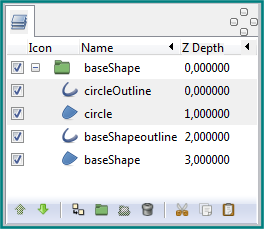
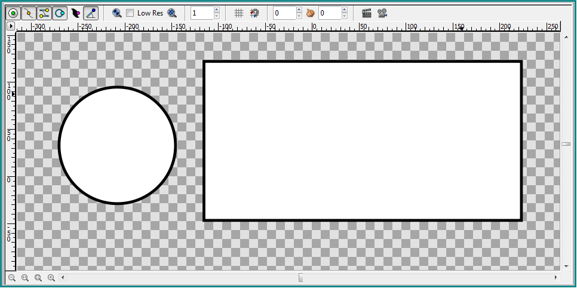
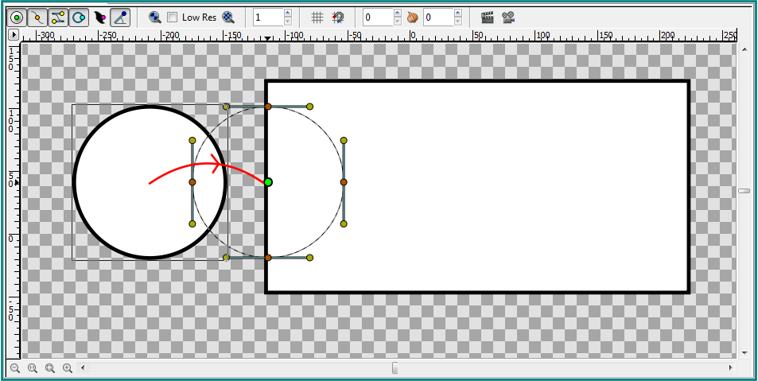
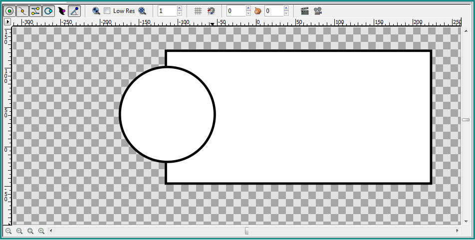
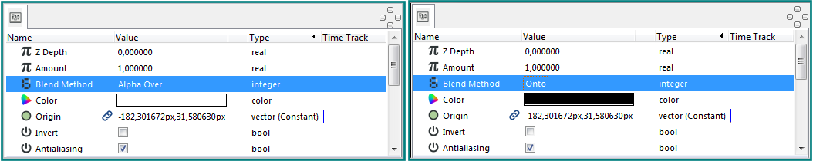
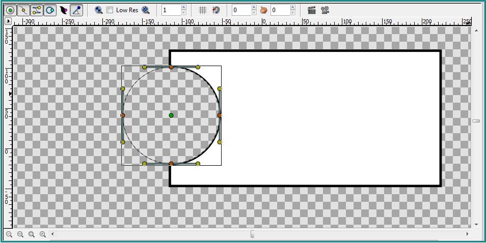
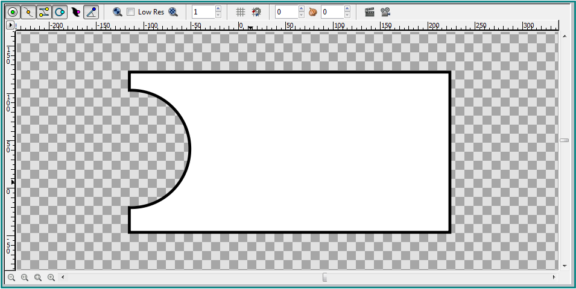
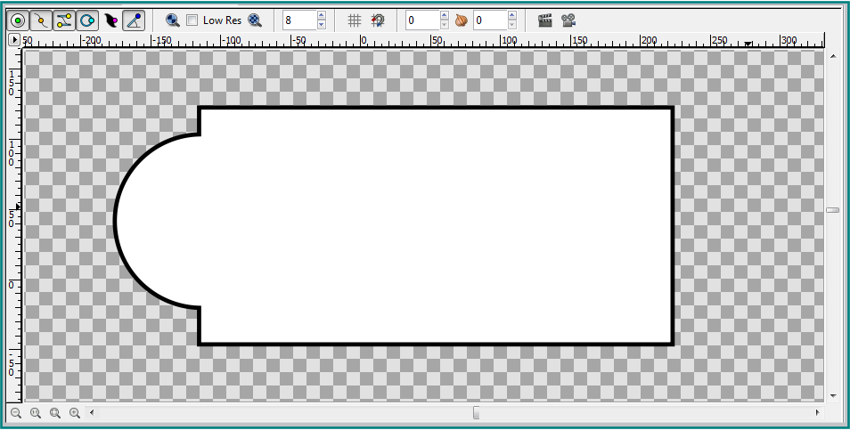
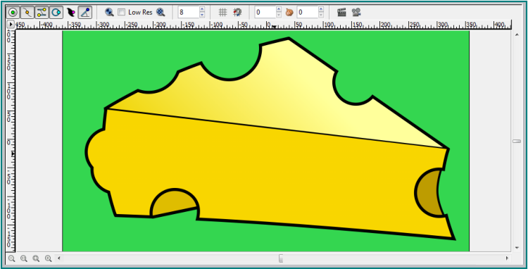

.. _tutorial_subtracting_shapes:

########################################
    Subtracting Shapes
########################################

Introduction 
========================
In this tutorial we are going to draw a shape and subtract another shape 
from it. We assume that you know how to draw a circle using the {{l|Circle Tool}} 
and a rectangle using the {{l|Rectangle Tool}}. If not then check {{l|Circle Tool|here}} and {{l|Rectangle Tool|here}}.

Drawing the shapes
==========================

Click the {{l|Circle Tool}} on the {{l|Toolbox|toolbox}} and draw a circle on the
canvas with an outline of 3 pixels. Make sure that the create region layer and
the create outline layer in the {{l|Tool Options Panel}} of the 
{{Literal|Circle tool}} are selected.

Click the {{l|Rectangle Tool}} on the {{l|Toolbox|toolbox}} and draw a rectangle
on the canvas with an outline of 3 pixels. Again make sure that the create region
layer and the create outline layer in the {{l|Tool Options Panel}} of 
the {{Literal|Rectangle tool}} are selected.

For the sake of this example name the circle outline layer '''circleOutline''' 
and the circle region layer '''circle''' in the {{l|Layers Panel}}. Again in 
the {{l|Layers Panel}} rename the rectangle region layer '''baseShape''' and 
name the rectangle outline layer '''baseShapeoutline'''. If it is not already 
the case then select the '''circleOutline''' layer and the '''circle''' layer 
and move them to the top using the green arrows in the {{l|Layers Panel}}. Select 
all layers in the {{l|Layers Panel}}, right-click and choose group. Name the 
group '''baseShape'''. 

   Layers Panel should look like this

Subtracting the shape
==========================

   Canvas should look like this

Click on the '''circle''' layer in the {{l|Layers Panel}} or on the circle shape in the canvas and select the green handle in the middle of the circle and drag it over the '''baseShape'''. Release the mouse.

   Drag the circle
   

   Canvas should look like this
   
Select the '''circleOutline''' layer in the {{l|Layers Panel}}, go to 
the {{l|Parameters Panel}} and change the {{Literal|Blend Method}} of the 
'''circleOutline''' layer to {{Literal|Onto}}.
Select the '''circle''' layer in the {{l|Layers Panel}}, go to 
the {{l|Parameters Panel}} and change the {{Literal|Blend Method}} of 
the '''circle''' layer to {{Literal|Alpha Over}}.

   Parameters Panel with blend method of Circle layer and CircleOutline layer
   

   Outline Width is not the same

The circle layer was subtracted from the '''baseShape''' but the {{Literal|Outline Width}} of the cut out part varies from the {{Literal|Outline Width}} of the '''baseShape'''. To adjust this we have to change the {{Literal|Outline Width}} of the '''circleOutline''' layer. Select the '''circleOutline''' layer in the {{l|Layers Panel}}, go to the {{l|Parameters Panel}} and change the {{Literal|Outline Width}} to 6 pixels.
After we adjusted the {{Literal|Outline Width}} of the '''circleOutline''' layer the '''circle''' layer was subtracted correctly from the '''baseShape'''.

   Final image

Tip
============
If we want to add a '''circle''' to the '''baseShape''' then all we have 
to do is change the {{Literal|Blend Method}} of the '''circleOutline''' layer 
from {{Literal|Onto}} to {{Literal|Behind}} and change 
the {{Literal|Blend Method}} of the '''circle''' layer from {{Literal|Alpha Over}} 
to {{Literal|Composite}}.

   Circle added to the baseShape

Below we can see an image of a piece of cheese that is almost entirely 
constructed by subtracting and adding circles to a basic underlying shape.

   All holes in the cheese image are subtracted circles

