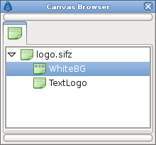

.. _panel_canvas_browser:

############################
    Canvas Browser Panel
############################

.. figure:: panel_canvas_browser_dat/Canvas_icon.png
   :alt: Canvas_icon.png
   :width: 64px

The ``Canvas Browser`` dialog shows the tree of canvases that are
present in the currently selected document:

|Export| a canvas parameter of a |Group| Layer
will cause the canvas to be added to the ``Canvas Browser`` dialog.
Double-clicking on a sub-canvas in the dialog will open a new Work Area
window allowing you to work on the sub-canvas separately.

.. |Export| replace:: :ref:`Export <export>`
.. |Group| replace:: :ref:`Group <group>`

