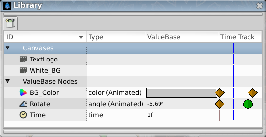

.. _panel_library:

########################
    Library Panel
########################

  
The ``Library Panel`` shows all exported |ValueNode| and
all canvases in the current animation.

If you find yourself using a particular Color over and over again, it's
a good idea to export it into the Library Panel so you can easily pick
the same Color in the future. Simply right-click on the Color in the
|Parameters_Panel| and choose “|Export|”
from the menu. You will be prompted for a name to associate with the
value. In order to see the newly exported value in the Library Panel,
you will have to open up the ``ValueBase Nodes`` tree if it isn't
already opened. The same technique works for any other parameter as
well, even for complete animated Spline paths.

To use a value that you have exported into the ``Library Panel`` in a
different layer, simply select the value in the ``Library Panel`` then
right-click the parameter you want to apply it to in the |Parameters_Panel|. Select “|Connect|” to use the
value.

The values stored in the ``Library Panel`` store their animations with
them. So if you have a Circle whose Color changes from red to yellow
over time, and export that Circle's Color parameter and use it to Color
a Rectangle, the Rectangle will also change from red to yellow over
time, in exactly the same way. The Color of the two shapes will now be
linked, so editing either one of them will affect the other.

When a value is selected in the ``Library Panel``, its handle will be
shown in the |Work_Area_Window|. These handle will
remain as you switch from layer to layer, which can be confusing.

It is possible, using drag and drop, to organise the values in the
``Library Panel`` into a hierarchical structure, but currently the
structure you create isn't saved into the .sifz file, so any
organisation you do will be lost when you next open the document.

.. |ValueNode| replace:: :ref:`ValueNode <valuenode>`
.. |Parameters_Panel| replace:: :ref:`Parameters Panel <panel_parameters>`
.. |Export| replace:: :ref:`Export <export>`
.. |Connect| replace:: :ref:`Connect <linking>`
.. |Work_Area_Window| replace:: :ref:`Work Area Window <canvas_workarea>`
