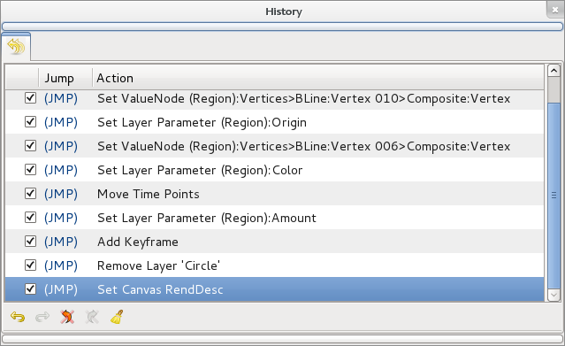

.. _panel_history:

########################
    History Panel
########################

The history panel keeps track of all the actions that are made in Synfig
Studio while editing a file. This history list is empty for a new clean
file and also when the file already exists and is opened, so it is not
saved with the file (is it worth to save it in the sifz file?).

When a single user operation produces a lot of actions (typically when
manipulating lots of `Handles <Handle>`__ at the same time) all those
common actions are grouped into a expandable one. See the small triangle
in the image sample. By clicking on the small triangle you can expand
the grouped actions and access them individually.

The check box column is used to disable specific actions without having
to go back through the entire actionlist. So if you want to redo or undo
a specific action (or group of actions) just click on the check box.

The ``(JMP)`` column is used to redo or undo all actions from the
current situation to the action where you clicked on the ``(JMP)`` word.

The ``Action`` column gives a description of the action itself. It
attempts to give a concise but meaningful description of the action.

The ``Undo`` and ``Redo`` buttons undo or redo a single action each time
they are pressed.

Finally the ``Clear Undo`` and ``Clear Redo`` buttons clean the history
list of ``Undo`` and ``Redo`` actions. The Clear Undo and Clear Redo
actions cannot be undone.

