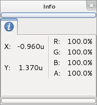

.. _panel_info:

########################
    Info Panel
########################

The Info panel

The info panel shows information, such as the current cursor/selection
location on the canvas. Also it displays the current RGBA values of the
cursor position on the canvas.

