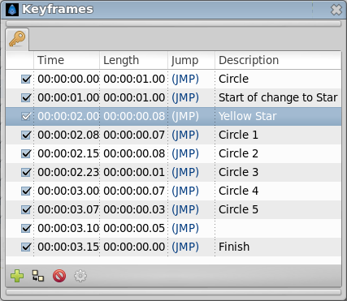
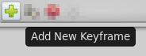
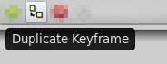

.. _panel_keyframes:

########################
    Keyframes Panel
########################

The ``Keyframes`` panel is where you make new |Keyframe|
for the animation.

 
These will show up in the |Timetrack| dialog. To jump to a
specific keyframe, double click on the ``(JMP)`` column.

The Add keyframe ([Keyframe#Add\_a\_keyframe]) button adds a new
keyframe to the current frame - a frame where there is no keyframe set
already. Remove keyframe ([Keyframe#Remove\_a\_keyframe]) removes a
keyframe. The Duplicate keyframe ([Keyframe#Duplicate\_a\_keyframe])
button copies the keyframe to the current frame. The Keyframe Properties
([Keyframe#Editing\_Keyframe\_Properties]) button display the Keyframe
Dialog ([Keyframe#Editing\_Keyframe\_Properties]) of the selected
keyframe.

Don't forget to set the ``Description`` of your keyframes, this
description will be displayed in the upper left corner of the canvas
window.

Right click in keyframe list open the keyframe contextual menu for the
selected keyframe.

.. _panel_keyframes  Adding, duplicating and removing keyframes:

Adding, duplicating and removing keyframes
------------------------------------------

.. _panel_keyframes  Add a keyframe:

Add a keyframe
~~~~~~~~~~~~~~

  
Place the time cursor at a frame where there isn't currently any
keyframe. Then press the ``Add new Keyframe`` button. If you place the
time cursor at a frame where there is currently an existing keyframe or
if animation Start Time egals animation End Time (animation Duration is
0m 0s 1f) then the ``Add new Keyframe`` button is disabled. Once you
press the button then a new entry is added to the list of keyframes and
a vertical dashed line is added in the time line. No waypoint is
created.

.. _panel_keyframes  Duplicate a keyframe:

Duplicate a keyframe
~~~~~~~~~~~~~~~~~~~~

Select a keyframe in the keyframe list of the |Keyframes_Panel| and place the cursor at a frame where there
isn't currently any keyframe. Then press the ``Duplicate Keyframe``
button. This would have two separated effects:

#. If there is a waypoint at the original keyframe then the waypoint is
   duplicated. Its duplication includes the parameter value and its
   interpolation types.
#. If there is no waypoint in the original keyframe for any particular
   parameter then two things could happen:

   -  There is no waypoint for that parameter at ANY frame in the time
      line: Then NO waypoint is created.
   -  If there is a waypoint in the time line for that parameter, but
      not in the keyframe that is going to be duplicated, then in the
      duplicated keyframe is created a new waypoint with a value for the
      parameter of the result of the current value at the original
      keyframe and a ``TCB Smooth`` interpolation type for both ``In``
      and ``Out``.

Of course, duplicate a keyframe will produce a new keyframe at the place
pointed by the time cursor and will add a new one to the keyframe list
in the proper place. In the keyframe list, the new added keyframe have
the same description than the original, plus a ``(Duplicate)`` at the
end.

`video explanation <https://youtu.be/qvRt3ITSkrQ>`__

.. _panel_keyframes  Remove a keyframe:

Remove a keyframe
~~~~~~~~~~~~~~~~~

  
Just select a keyframe from the keyframe list and press the Remove
keyframe button. It will remove the keyframe and all the waypoints for
all parameters for all layers that are currently there.

.. note::
   If you move a keyframe by modifying its time ([#Time]) in the
   keyframe list dialog and immediately press the Remove Keyframe button
   then the waypoints are not deleted. It seems to be a bug but also can be
   considered a feature if you really want to keep the waypoints and not
   the keyframe.*\ 
