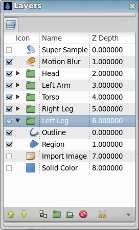

.. _panel_layers:

########################
   Layers Panel
########################

.. _panel_layers  Summary:

Summary
-------

The Layers Dialog allows you to view and manipulate the layer hierarchy
in your scene. This is where you can determine which objects get drawn
first, and create |Group_Layer| for the purpose of
applying effects.

.. _panel_layers  Elements of the Layers Dialog:

Elements of the Layers Dialog
-----------------------------

The Layers Dialog contains a detailed list of the |Layer| in
your scene. Each row represents a layer, and the columns are:

**Show/Hide checkbox**
    Turns the layer on or off in the composition. This parameter is not
    keyable.
**Icon**
    The icon representing the layer type. For
    |Region_Layer|, |Outline_Layer|, and , the
    icons will be those of the |Spline_Tool|, the |Width_Tool|, and the |Gradient_Tool|,
    respectively. For both |Group_Layer| and
    |Switch_Group_Layer|, an expand icon
    (generally an arrow) precede the layer icon. This expander can be
    controlled with ``+`` and ``-`` respectively to open or close the
    group.
**Name**
    The name of the layer you're currently working on.
**Z Depth**
    The Z Depth column indicates the Z position of the layer, which can
    also affect layer compositing. It does not always appear, for
    example, if the time of the canvas is “0”, this column will
    disappear.

.. _panel_layers  Layer Commands:

Layer Commands
~~~~~~~~~~~~~~

Below the layer list, are buttons (and a drop down menu containing any
buttons that don't fit on the palette). These expose the most useful
layers' commands, more commands can be found in the |Canvas_Layer_Menu| from the |Canvas_Menu_Caret|, or in the context menu of the Layer Panel.

.. _panel_layers  Moving layers:

Moving layers
~~~~~~~~~~~~~

To move multiple layers first select them by holding ``ctrl`` or
``shift``. Then at the last of the layers you want to move click it but
do not release the mouse button, instead release the keyboard controller
(``ctrl`` or ``shift``). Now you can drag the layers to where you want
them, release mouse button to drop the layers in place.

`Gradients <Category:Gradients>`__

.. |Group_Layer| replace:: :ref:`Group Layer <layer_group>`
.. |Layer| replace:: :ref:`Layer <layers>`
.. |Region_Layer| replace:: :ref:`Region Layer <layer_region>`
.. |Outline_Layer| replace:: :ref:`Outline Layer <layer_outline>`
.. |Spline_Tool| replace:: :ref:`Spline Tool <tool_spline>`
.. |Width_Tool| replace:: :ref:`Width Tool <tool_width>`
.. |Gradient_Tool| replace:: :ref:`Gradient Tool <tool_gradient>`
.. |Switch_Group_Layer| replace:: :ref:`Switch Group Layer <layer_switch_group>`
.. |Canvas_Layer_Menu| replace:: :ref:`Canvas: Layer Menu <canvas_layer_menu>`
.. |Canvas_Menu_Caret| replace:: :ref:`Canvas: Menu Caret <canvas_caret>`
