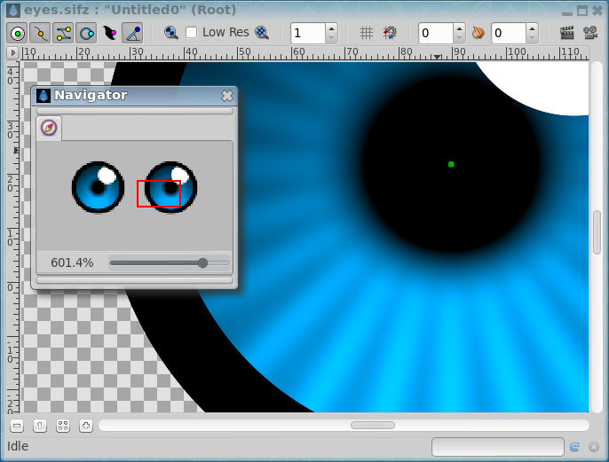

.. _panel_navigator:

########################
    Navigator Panel
########################

The Navigator dialog allows the user to position the zoomed working view
quickly to the desired area.

  
The navigator dialog shows you a thumbnail view of the currently
selected canvas with a red rectangle indicating which part of the canvas
is currently displayed in the editing window.

You can zoom in and out by dragging the zoom slider at the bottom. Also
the zoomed area can be panned by dragging the red rectangle around.

Alternatively you can zoom and pan the |WorkArea| using the
following mouse shortcuts in the |Canvas| window:

#. Mouse wheel pans up and down.
#. ``SHIFT`` + mouse wheel pans left and right.
#. ``CTRL`` + mouse wheel zooms in and out.

Zoom in limit is 1600% and out limit is 6.2%.

It is possible to zoom in with ``CTRL`` + mouse wheel beyond 1600% but
can cause Synfig Studio to hang or crash in some situations.

.. |WorkArea| replace:: :ref:`Workarea <canvas_workarea>`
.. |Canvas| replace:: :ref:`Canvas <canvas>`