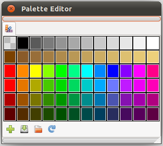

.. _panel_palette_editor:

###########################
  Palette Editor Panel
###########################
|Palette_icon.png|

|Palette_editor_panel.png|

Here you can add, edit or delete your preferred colors from your
document. A right click on a color gives you 2 options: color (to edit
the color) and delete (to delete it).

|Palette_editor_panel_icons.png| The buttons at the bottom of the
panel allow you to:

-  **Add** the current outline color to the palette
-  **Save** the current palette in Synfig Palette format (.spal)
-  **Load** a palette in Synfig Palette (.spal) or GIMP Palette (.gpl)
   formats
-  **Reset** the current palette colors, discarding any change you've
   done.

