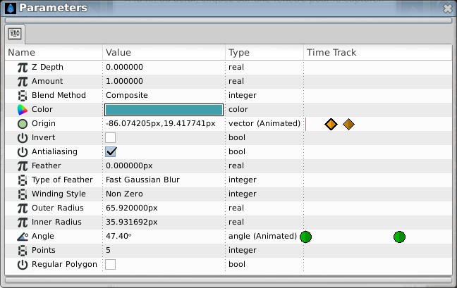

.. _panel_parameters:

########################
    Parameters Panel
########################

.. raw:: mediawiki

   {{Category|Panels}}

.. raw:: mediawiki

   {{Category|Parameters}}

.. raw:: mediawiki

   {{NewTerminology}}

.. figure:: panel_parameters_dat/Params_icon.png
   :alt: params_icon.png
   :width: 60px

.. _panel_parameters  Introduction:

Introduction
------------

The Parameters Panel is in many ways the heart of the Synfig interface.
This is where all the |Parameter| of the
|Layer| you create are edited, and in some less obvious ways.

The layout of the Parameters Panel is quite simple - it is a table.

   Stars Layer Parameters

The first column, named ``Name``, is simply an expandable tree listing
of the parameters of the selected layer. Most layers do not have many
nested parameters, with the exception of the Vertex List on most
|Geometry_Layer_Category|.

The second column, ``Value``, is where the data for each of the
parameters are listed. Several different types of data can be shown
here.

The third column, ``Type``, show the data `type <Dev:Types>`__.

The last column, ``Time Track``, display a simplified
|Timetrack_Panel|

.. _panel_parameters  Parameters and Layers:

Parameters and Layers
---------------------

An interesting feature of the Parameters Dialog is that - when you
select two or more layers in the |Layers_Panel|, the
Parameters Panel will only show the parameters that are \*shared\*
between the layers. When the dialog is in this state, context-clicking
on the parameters will allow parameters to be |Linking|
between the two layers. *(write more)*

.. _panel_parameters  Default Parameters:

Default Parameters
------------------

There are three parameters that are shared between nearly every layer:

-  |Z_Depth_Parameter|
-  |Amount_Parameter|
-  |Blend_Method|

.. _panel_parameters  Interpolation:

Interpolation
-------------

It is possible to fix interpolation by |Parameter|.
Right-click any parameter and choose its default interpolation from a
submenu. The defined interpolation is indicated in the Parameters Panel
with corresponding icon near the parameter value.

