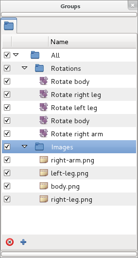

.. _panel_sets:

########################
    Sets Panel
########################

images outdated!

.. _panel_sets  Introduction:

Introduction
============

Suppose you want to treat several shapes in the same way, but they are
scattered in your project and placed on different layers. Rather than
develop each and select them individually each time you want to change
them, you can use sets. 

|Set\_Panel.png| 

To add some layers to a set
select them in the |Layers_Panel|, right click, and
choose ``Add to Set``. It will prompt you for a Set name. Type a name
for a new, or existing set and click ``OK``.

Now you can select that set and animate all those layers together (for
instance, change all their |Amount_Parameter|, or move their
|Origin_Parameter|).

.. _panel_sets  Digging deeper:

Digging deeper
==============

.. _panel_sets  Action over Sets:

Action over Sets
----------------

Current interaction with sets and its layers in Sets Panel can be
described in following terms:

-  Double click over a Set icon selects all its layers in the Layers
   Panel. **It allows a multiple selection of scattered layers with just
   one double click**. Notice that double click does not highlight the
   layers in the Sets Panel.
-  Double click over a icon of a layer from a set, selects that layer on
   the Layers Panel and unselects all others.
-  Double click holding ``ctrl`` key over a Set icon or layer icon from
   a set, adds the selection to the current one at the Layers Panel.
-  Double click over a set or layer name allows to rename it.
-  Clicking the checkbox on the left of layer icon will deactivate the
   layer in the Layers Panel.
-  Clicking the checkbox near the set icon will deactivate all layers
   inside of this set.
-  A layer in a set can be moved to any other set (empty or not).
-  If the set is empty it can't be activated and won't be saved.
-  Single left or right click over a Set makes it selected. You can use
   it to enable the ``Remove Set`` button.
-  Single left click over layer in a set selects it. You can select
   multiple layers if you click holding ``ctrl`` or ``shift`` key, but
   the effect on subsequent commands only affect the layer that you
   right-click on.

.. _panel_sets  Action over Layers:

Action over Layers
------------------

Single right click over a layer in a set pops up the context menu with
the same elements as you have for each layer in the |Layers_Panel|:

-  `Command:Select All Children <Command:Select_All_Children>`__: This
   menu entry appears only if the layer from the set is a Group layer.
   The behavior is the same as in the Layers Panel - all layers inside
   of the Group layer are selected.
-  `Command:Add Layers to Set <Command:Add_Layers_to_Set>`__: Displays a
   dialog to enter a Set name and moves the select layer to the new set.
   Only works for the layer below the cursor when multiple selection is
   done.
-  `Command:Remove Layers from a
   Set <Command:Remove_Layers_from_a_Set>`__: Removes the selected layer
   from the set. Only one layer at a time can be removed. Even if
   multiple layers are selected only the layer below the cursor when
   right clicking is removed.
-  `Command:Duplicate layer <Command:Duplicate_layer>`__: Works the same
   as duplicate layer from the Layers Panel and also add the duplicated
   layer to the current Set. It works partially because you cannot
   duplicate multiple layers as in the Layers Panel. It only acts over
   the layer you did the right click. The selection is ignored.
-  Command:Group: It works the same as the Command:Group layers from the
   Layers Panel but only affects to the layer where the right click is
   done.
-  `Command:Remove Layer <Command:Remove_Layer>`__: It works the same as
   the `Command:Remove Layers <Command:Remove_Layers>`__ from the Layers
   Panel but only affects to the layer where the right click is done.
-  `Command:Set Layer Description <Command:Set_Layer_Description>`__:
   Displays a dialog for renaming the layer.
-  `Command:Raise Layer <Command:Raise_Layer>`__ / `Command:Lower
   Layer <Command:Lower_Layer>`__: Does the same than in the Layers
   Panel. It doesn't modify the position of the layer in the Set but the
   position in the Layers Panel hierarchy is modified as expected.

Notice, that a layer can only belong to one Set at a time. Adding a
layer to a Set when it's already in previous set will remove it from the
previous set.

.. _panel_sets  Sets can be nested:

Sets can be nested
------------------

You can make nested sets one of the following ways:

-  by adding a layer to a set with a name containing dot as separator:
   “parent.child”
-  by dragging a set inside other set.

The contents of the nested sets is selected when you double-click the
parent set icon. Depending on what set level you click you can select
more or less layers.

  
For example making a double click on the 'All' Set will select Rotation
and Image layers in once double click.

Regarding to the buttons:

-  ``Add New Set`` button adds empty deactivated set.
-  ``Remove Set`` button removes selected set. If the set contains other
   sets they are not recursively deleted, only the first child level of
   layers.

Also Sets scope is the current edited Canvas. That means that only the
layers in a set that belong to the current Canvas being edited are show
in the Sets Panel. It also means that Sets are File/Canvas dependent. It
means that a layer can only belong to a set defined in its exported
canvas scope. For example, if there are two canvases where B is the root
one and A is a exported one hold by a Group Layer inside B, then a layer
that belongs to exported canvas A can belong only to Sets defined at
canvas A scope. Although you can select the layer from the outer root
canvas (B) you cannot add it to a set defined at B scope. You can also
have sets with the same name in different file/canvas scope. If a layer
is dragged out from a pasted canvas and it belongs to a set, the set
name is dragged out also.

.. _panel_sets   :

 
--------------

Here are shown some examples of what can be done using sets for a
complex file:

+---------------+--------------------------------------------------------+--------------------------------------------------------+
| **Samples**   | **Sets**                                               | **Effects after double click on the highlighted Set**  |
+---------------+--------------------------------------------------------+--------------------------------------------------------+
|  Sample1      | |Groups_sample1.png|                                   | |Groups_sample1_doubleclick_effect.png|                |
+---------------+--------------------------------------------------------+--------------------------------------------------------+
|  Sample2      | |Groups_sample2.png|                                   | |Groups_sample2_doubleclick_effect.png|                |
+---------------+--------------------------------------------------------+--------------------------------------------------------+

.. |Groups_sample1_doubleclick_effect.png| image:: panel_sets_dat/ Groups_sample1_doubleclick_effect.png
.. |Groups_sample2_doubleclick_effect.png| image:: panel_sets_dat/ Groups_sample2_doubleclick_effect.png 
   

