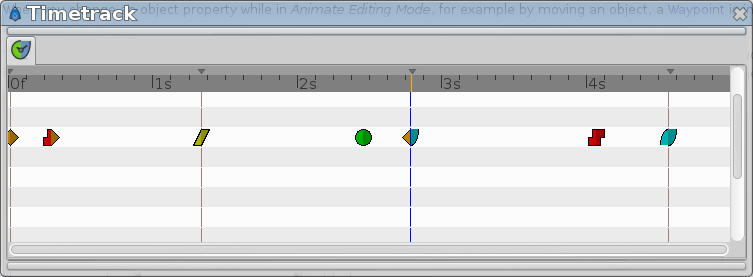
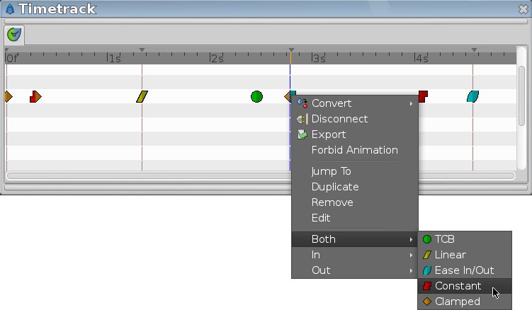

.. _panel_timetrack:

########################
    Timetrack Panel
########################

|Time\_track\_icon.png| 

The ``Timetrack Panel`` shows a symbol ([Waypoints#Graphical\_Representation]) (usually a green dot) for every |Waypoint| in the timeline. 
|Keyframe| are represented by vertical lines through the timeline. 
The |Time_Cursor| shows you with another vertical line at which frame you currently are at.

  
When you change an object parameter while in |Animate_Editing_Mode|, for example by moving an object, a
|Waypoint| is inserted. The rows of the ``Timetrack Panel``
are aligned with the |Parameters_Panel|. If you are
animating the individual vertices, you have to expand the vertices list
to see their individual waypoints.

You can drag those |Waypoint| through time, and you can
change their interpolation method ([Waypoints#Interpolation]) by
right-clicking (eg. a sudden step change instead of a smooth
transition). You can also change the default interpolation method from
the Toolbox Panel in the |New_Layer_Defaults| section. The very
bottom control sets the default method, and is initially set to
|Clamped|.

Holding ``CTRL`` allows you to select more than one waypoint for a given
valuenode at a time.

-  When nothing is selected, clicking on a point in either normal mode
   or additive mode will select the time point closest to the click.
   Subtractive click will do nothing
-  When things are already selected, clicking on a selected point does
   nothing (in both normal and add mode). Add mode clicking on an
   unselected point adds it to the set. Normal clicking on an unselected
   point will select only that one time point. Subtractive clicking on
   any point will remove it from the the set if it is included.

Normal click out of a waypoint unselect all.

Holding ``SHIFT`` when beginning to drag waypoints will copy them rather
than moving them.

Holding ``ALT`` while clicking waypoints will delete them.

Further reading:

-  |Keyframe|
-  |Waypoint|
-  |Timebar|

Interested in future things ?
 `Waypoints ... what could be the future of...? <https://forums.synfig.org/t/waypoints-what-could-be-the-future-of/2944>`__ in the synfig forum.

.. |Waypoint| replace:: :ref:`Waypoint <waypoints>`
.. |Keyframe| replace:: :ref:`Keyframe <keyframes>`
.. |Time_Cursor| replace:: :ref:`Time Cursor <glossary_time_cursor>`
.. |Animate_Editing_Mode| replace:: :ref:`Animate Editing Mode <animation_mode>`
.. |Parameters_Panel| replace:: :ref:`Parameters Panel <panel_parameters>`
.. |New_Layer_Defaults| replace:: :ref:`New Layer Defaults <new_layer_defaults>`
.. |Clamped| replace:: :ref:`Clamped <interpolations_Clamped>`
.. |Timebar| replace:: :ref:`Timebar <timebar>`