.. _panel_tool_options:

########################
    Tool Options Panel
########################

.. _panel_tool_options  Introduction:

Introduction
============

The ``Tool Options Panel`` displays the options you have available to
apply to the |Toolbox| you're using. For the tools that
can create multiple layers at the same time the panel contextually
display the available options for the selected type of layers.

The icon for the Tool Options Panel always changes to what tool you're
currently using.

The values of the ``Tool Options Panel`` parameters are stored between
tool usages and between SynfigStudio sessions, so you can reuse them as
may times as you like.

This is the list of available options for each tool:

.. _panel_tool_options  |Tool\_Normal.png| |Transform_tool|:

|Tool\_Normal.png| |Transform_tool|
------------------------------------------------------

* None

.. _panel_tool_options  |Tool\_smooth\_move.png|\ |Smooth_Move_Tool|:

|Tool\_smooth\_move.png|\ |Smooth_Move_Tool|
-----------------------------------------------------------------

* Radius (real number)

.. _panel_tool_options  |Tool\_scale.png| |Scale_Tool|:

|Tool\_scale.png| |Scale_Tool|
---------------------------------------------

The |Tool_Options_Panel| allows you to specify:

-  **Lock Aspect Ratio** : Prevent from changing the ratio x:y of the
   bounding box of the selected Handles.
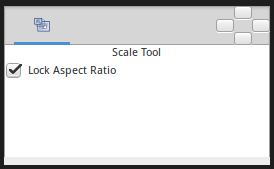

.. _panel_tool_options  |Tool\_rotate.png| |Rotate_Tool|:

|Tool\_rotate.png| |Rotate_Tool|
------------------------------------------------

-  **Allow Scale** : Allow the selected Handles to be scaled and rotated
   at the same time.
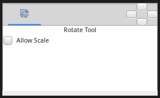

.. _panel_tool_options  |Tool\_mirror.png| |Mirror_Tool|:

|Tool\_mirror.png| |Mirror_Tool|
------------------------------------------------

-  **Horizontal** : Horizontal axis mirror.
-  **Vertical** : Vertical axis mirror.
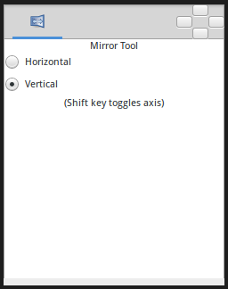

.. _panel_tool_options  |Tool\_circle\_icon.png| |Circle_Tool|:

|Tool\_circle\_icon.png| |Circle_Tool|
------------------------------------------------------

|Circle\_Tool\_Options.png| 

The |Tool_Options_Panel| allows you to specify:

-  **Name** : Used for the new layer; any number in this field will
   automatically increment with each layer created.
-  **Layer Type** : Whether create |Star_Layer| and/or
   |Outline_Layer|, |Advanced_Outline_Layer|, |Region_Layer|,
   |Plant_Layer| and |Curve_Gradient_Layer|
   layers (Splines).
-  **|Blend_Method_Parameter|** : The blending method
   used to composite on the layers below.
-  **Opacity** : Sets the |Amount_Parameter| for
   new layers. Defaults to **1.00** (Completely opaque).
-  **Brush Size** : Sets the Outline width
   ([Outline\_Layer#Outline\_width]) or the size of the gradient (only
   for |Outline_Layer|, |Advanced_Outline_Layer| and |Curve_Gradient_Layer|).
-  **Spline Points** : Specify the number of Spline Points that will be
   used in the new Splines (for other than |Circle_Layer|).
-  **Offset** : Offset of the tangent of the Spline Points (for other
   than |Circle_Layer|).
-  **Invert** : Whether invert the create(d) layer(s). Is related to his
   |Invert_Parameter|.
-  **|Feather_Parameter|** : Width of the area to be
   dissolved at the edge (not for |Plant_Layer| and |Curve_Gradient_Layer|).
-  **Falloff** : Determines the falloff function for the feather (only
   for |Circle_Layer|).
-  **Link Origins** : Whether Link the Offset of Splines.
-  **Spline Origins at Center** : Set the origin of the layer at the
   center of the circle, else the center is set at the
   |Canvas| center.
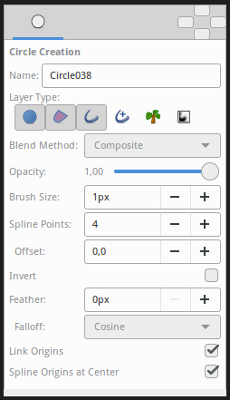

.. _panel_tool_options  |Tool\_rectangle\_icon.png| |Rectangle_Tool|:

|Tool\_rectangle\_icon.png| |Rectangle_Tool|
---------------------------------------------------------------

|Rectangle\_Tool\_Options.png| 

The |Tool_Options_Panel| allows you to specify:

-  **Name** : Used for the new layer name; any number in this field will
   automatically increment with each layer created.
-  **Layer Type** : Create |Rectangle_Layer| and/or
   |Region_Layer|, |Outline_Layer|, |Advanced_Outline_Layer|, |Plant_Layer| and
   |Curve_Gradient_Layer| (Splines).
-  **|Blend_Method_Parameter|** : How to combine the
   new layer with the background.
-  **Opacity** : Sets the |Amount_Parameter| for
   new layers. Defaults to **1.00** (Completely opaque).
-  **Brush Size** : Sets the Outline width
   ([Outline\_Layer#Outline\_width]) or the size of the gradient (only
   for |Outline_Layer|, |Advanced_Outline_Layer| and |Curve_Gradient_Layer|).
-  **Expansion** : Expand the rectangle from his corners (only for
   |Rectangle_Layer|. Is related to his |Expansion_Amount_Parameter|).
-  **|Feather_Parameter|** : Width of the area to be
   dissolved at the edge (not for |Rectangle_Layer|,
   |Plant_Layer| and |Curve_Gradient_Layer|).
-  **Invert** : Whether invert the create(d) layer(s). Is related to his
   |Invert_Parameter|.
-  **Link Origins** : Whether Link the Offset of Splines.
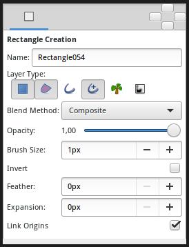
   

.. _panel_tool_options  |Tool\_star\_icon.png| |Star_Tool|:

|Tool\_star\_icon.png| |Star_Tool|
------------------------------------------------

|Star\_Tool\_Options.png| 

The |Tool_Options_Panel| allows you to specify:

-  **Name** : The name used for the new layer; any number in this field
   will automatically increment with each layer created.
-  **Layer Type** : Whether create |Star_Layer| and/or
   |Outline_Layer|, |Region_Layer|,
   |Plant_Layer| and |Curve_Gradient_Layer|
   layers (Splines).
-  **|Blend_Method_Parameter|** : How to combine the
   new layer with the background.
-  **Opacity** : Sets the |Amount_Parameter| for
   new layers. Defaults to **1.00** (Completely opaque).
-  **Brush Size** : Sets the Outline width
   ([Outline\_Layer#Outline\_width]) or the size of the gradient (only
   for |Outline_Layer|, |Advanced_Outline_Layer| and |Curve_Gradient_Layer|).
-  **Star Points** : The number of peaks of the star.
-  **Offset** : The rotation offset of the created star.
-  **Radius Ratio** : The ratio between the peaks and the troughs of the
   star.
-  **Regular Polygon** : Whether create a regular polygon instead of a
   star.
-  For Splines only, the tangent lengths for outer and inner vertices.
   Outer is limited to [-3,10] and inner is limited to [-3,3]. (*If you
   find useful open those limitations please write it in the talk page*).

   -  **Inner Width**
   -  **Inner Tangent**
   -  **Outer Width**
   -  **Outer Tangent**

-  **Invert** : Whether invert the create(d) layer(s).
-  **|Feather_Parameter|** : Width of the area to be
   dissolved at the edge (not for |Plant_Layer| and |Curve_Gradient_Layer|).
-  **Link Origins** : Whether Link the |Origin_Parameter| of Splines.
-  **Spline Origins at Center** : Set the |Origin_Parameter| of the layer at the center of the
   star, else the center is set at the |Canvas| center.
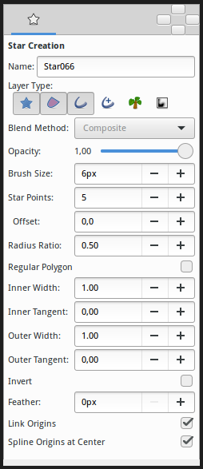

.. _panel_tool_options  |Tool\_polygon\_icon.png| |Polygon_Tool|:

|Tool\_polygon\_icon.png| |Polygon_Tool|
---------------------------------------------------------
|Polygon\_Tool\_Options.png| 

The |Tool_Options_Panel| allows you to specify:

-  **Name** : Used for the new layer; any number in this field will
   automatically increment with each layer created.
-  **Layer Type** : Whether create |Polygon_Layer|
   and/or |Outline_Layer|, |Advanced_Outline_Layer|, |Region_Layer|,
   |Plant_Layer| and |Curve_Gradient_Layer|
   layers (Splines).
-  **|Blend_Method_Parameter|** : The blending method
   used to composite on the layers below.
-  **Opacity** : Sets the |Amount_Parameter| for
   new layers. Defaults to **1.00** (Completely opaque).
-  **Brush Size** : Sets the Outline width
   ([Outline\_Layer#Outline\_width]) or the size of the gradient (only
   for |Outline_Layer|, |Advanced_Outline_Layer| and |Curve_Gradient_Layer|).
-  **Invert** : Whether invert the create(d) layer(s). Is related to his
   |Invert_Parameter|.
-  **|Feather_Parameter|** : Width of the area to be
   dissolved at the edge (not for |Plant_Layer| and |Curve_Gradient_Layer|).
-  **Link Origins** : Whether Link the Offset of Splines.
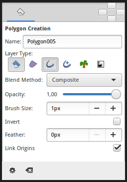

.. _panel_tool_options  |Tool\_gradient\_icon.png| |Gradient_Tool|:

|Tool\_gradient\_icon.png| |Gradient_Tool|
------------------------------------------------------------
|Gradient\_Tool\_Options.png| 

When you select the Gradient Tool, the |Tool_Options_Panel| will show the options
for the Gradient Tool.

These allow you to:

-  **Name** : Set a name for the layer you are about to create. The name
   of the layer can always be changed later via the |Layers_Panel| or the |Parameters_Panel| if necessary, but the type of gradient
   needs to be chosen now.
-  **Layer Type** : Choose the type of gradient to create (Linear,
   Radial, Conical, Spiral).
-  **|Blend_Method_Parameter|** : The blending method
   used to composite on the layers below.
-  **Opacity** : Sets the |Amount_Parameter| for
   new layers. Defaults to **1.00** (Completely opaque).

For help with editing gradient colors see the section on |Gradient_Editor_Dialog|.

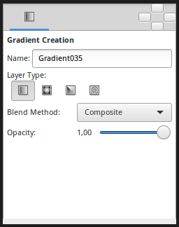

.. _panel_tool_options  |Tool\_bline\_icon.png|\ |Spline_Tool|:

|Tool\_bline\_icon.png|\ |Spline_Tool|
------------------------------------------------------
|Spline\_Tool\_Options.png| 

This tool has the following options:

-  **Name**: Sets the name of the Spline that you will create, in this
   case “Spline070”. If the ending part of the string contains an
   integer number, this input text box will parse it and increase that
   number for the next created Spline. Otherwise, it will add a three
   digit number while creating the next one.
-  **Layer Type**: Sets whether to create |Region_Layer|,
   |Outline_Layer|, |Advanced_Outline_Layer|, |Plant_Layer| and/or
   |Curve_Gradient_Layer| Layers.
-  **|Blend_Method_Parameter|**: Sets the blending
   method used to composite on the layers below.
-  **Opacity**: Sets the |Amount_Parameter| for new
   layers. Defaults to **1.00** (Completely opaque).
-  **Brush Size**: Sets the size of the line for |Outline_Layer| and/or |Advanced_Outline_Layer|.
-  **Feather**: Sets the |Feather_Parameter| of
   the |Region_Layer| or Outline Layer created.
-  **Link Origin**: If checked, links the |Origin_Parameter| for the |Plant_Layer|,
   |Region_Layer| or Outline if two of them (or all them) are
   checked.
-  **Auto Export**: If checked, exports automatically the |Vertices_Parameter| (that's a |Spline| type
   parameter).
   
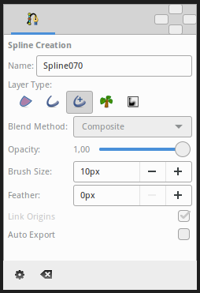

.. _panel_tool_options  |Tool\_draw\_icon.png| |Draw_Tool|:

|Tool\_draw\_icon.png| |Draw_Tool|
------------------------------------------------
|Draw\_Tool\_Options.png| 

The |Tool_Options_Panel| allows you to specify:

-  **Name** : Used for the new layer; any number in this field will
   automatically increment with each layer created.
-  **Layer Type** : Whether create |Outline_Layer| and/or
   |Advanced_Outline_Layer|,
   |Region_Layer| layers (Splines).
-  **|Blend_Method_Parameter|** : The blending method
   used to composite on the layers below.
-  **Opacity** : Sets the |Amount_Parameter| for
   new layers. Defaults to 1.00 (Completely opaque).
-  **Brush Size** : Sets the Outline width
   ([Outline\_Layer#Outline\_width]) or the size of the gradient (only
   for |Outline_Layer|, |Advanced_Outline_Layer| and |Curve_Gradient_Layer|).
-  **Pressure Sensitive**

   -  **Min Pressure** : The value of this option clamps the lower end
      of the Pressure sensitivity to a specific value, essentially
      determining how thin the thinnest possible segment is relative to
      the Brush Size ([New Layer Defaults#Brush Size]) parameter in the
      |Toolbox|.

-  **Smoothness** : Determines how much tablet jitter is removed, and as
   a result, how many vertices the resulting splines are composed of.
   Could by Local or Global

   -  **Local** : Adjust the Spline between the Splines points.
   -  **Global** : Adjust the Spline globally.

-  **Width Max Error** : for advanced outline layer.
-  **Round End** : The ends of the spline will be rounded, only for
   |Outline_Layer|, |Advanced_Outline_Layer| layers.
-  **Auto Loop** : When the stroke of the ``Draw Tool`` ends near the
   beginning of the stroke, automatically connect the last
   |Handle| to the first.
-  **Auto Extend** : When the stroke begins and/or end at or near an
   endpoint |Handle| of another |Outline_Layer|,
   the resulting |Outline_Layer| is simply appended to the
   existing |Outline_Layer|.
-  **Auto Link** : When the stroke begins and/or ends at or near a
   vertex Handle in another |Outline_Layer|, and the outline
   isn't being extended by the ``Auto Extend`` option above, the first
   and/or last vertex of the resulting |Outline_Layer| is
   |Linking| to the Handle on the existing |Outline_Layer|.
-  **Feather** : Set the |Feather_Parameter| on
   the layer.
-  **Auto Export** : Automatically |Export| the Spline list
   points into the Values Base Nodes of the |Library_Panel|.

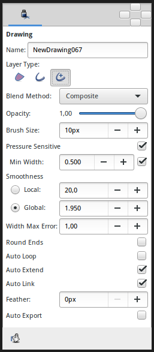

.. _panel_tool_options  |Tool\_cutout\_icon.png| |Cutout_Tool|:

|Tool\_cutout\_icon.png| |Cutout_Tool|
------------------------------------------------------
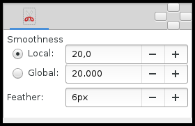
   
-  **Smoothness** : Adjust the Spline defining the Mask. Could be Local
   or Global

   -  **Local** : Adjust the Spline between the Splines points.
   -  **Global** : Adjust the Spline Globally.

-  **|Feather_Parameter|** : Width of the area that is going
   to be dissolved at the edge of the mask.

.. _panel_tool_options  |Tool\_width\_icon.png| |Width_Tool|:

|Tool\_width\_icon.png| |Width_Tool|
---------------------------------------------------
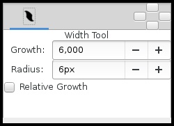

-  **Growth** - Defines how much a single mouse move will affect the
   line width. It must be non-zero for this tool to have an effect on
   the spline.
-  **Radius** - Defines the size of area around current cursor position
   in which a vertex will be affected. It is allows you to achieve a
   noticeable effect without having to follow the line precisely with
   the mouse. The Width Tool works fine on splines with lots of segments
   (such as those created with the |Draw_Tool|), you will
   see it works on more than just the first vertex. It is a full
   circular area, other points may get in the way though.
-  **Relative Growth** - Doesn't really work very well unless the
   ``Radius`` parameter is set to some huge value (like a million).   

.. _panel_tool_options  |Tool\_fill\_icon.png| |Fill_Tool|:

|Tool\_fill\_icon.png| |Fill_Tool|
------------------------------------------------
* None

.. _panel_tool_options  |Tool\_eyedrop\_icon.png| |Eyedrop_Tool|:

|Tool\_eyedrop\_icon.png| |Eyedrop_Tool|
---------------------------------------------------------
* None

.. _panel_tool_options  |Tool\_text\_icon.png| |Text_Tool|:

|Tool\_text\_icon.png| |Text_Tool|
------------------------------------------------
The |Tool_Options_Panel| allows you to specify:

-  the **Name** used for the new layer; any number in this field will
   automatically increment with each layer created.

-  ``Multiline Editor`` - whether to use a single or multi-line editor
   for entering the text. If a single line is used then the ``Enter``
   key will submit the value. In the multi-line editor, you'll need to
   click the ``OK`` button with the mouse to confirm the text or hit
   ``Ctrl|Tab`` to give focus to ``OK`` button.

-  ``Size`` **X** **Y** - the horizontal and vertical size of the text.

-  ``Orientation`` **X** **Y** - the orientation of the text. The
   default (**0.5**, **0.5**) means that the text will be centered
   around the point you clicked on. (**0**, **0**) means that the top
   left corner of a box containing the text will be placed where you
   clicked. (**1**, **1**) means that the bottom right corner of the
   text's bounding box will be placed where you clicked.

-  ``Family`` - the font family to be used.
   

.. _panel_tool_options  |Tool\_sketch\_icon.png| |Sketch_Tool|:

|Tool\_sketch\_icon.png| |Sketch_Tool|
------------------------------------------------------
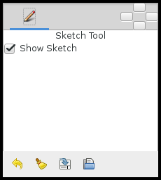

The Sketch Tool has the following in its |Tool_Options_Panel| :

-  **Show Sketch**: a checkbox for toggling the visibility of the sketch
   overlay **On** and **Off**.
-  **Undo Last Stroke**: cancels the most recent edit to the sketch
   overlay. Can be repeatedly clicked to cancel more edits.
-  **Clear Sketch**: clears the current workarea's sketch overlay.
-  **Save Sketch As...**: writes the sketch overlay from the current
   workarea to a .sketch file.
-  **Open a Sketch**: loads a previously saved .sketch file, overwriting
   any previously drawn or opened sketch in the current workarea.

Sketch uses the color of the default ``foreground color`` in the |Toolbox|.

.. _panel_tool_options  |Tool\_brush\_icon.png| |Brush_Tool|:

|Tool\_brush\_icon.png| |Brush_Tool|
---------------------------------------------------
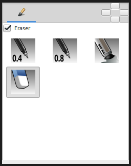

-  Eraser check box. When checked, the brush acts as a rubber.
-  Display the set of configured brushes (MyPaint brushes format). By
   default, Synfig is installed with a selected set of brushes from
   “Concept Design (C\_D)” pack by `Ramon
   Miranda <http://www.ramonmiranda.com/2011/09/mypaint-concept-design-set-es.html>`__.
   
   From the |Preferences_Dialog_System|,
   you can configure the ``Brush Presets Path`` to use other brushes
   package (for example the ones listed by
   `MyPaint <https://github.com/mypaint/mypaint/wiki/Brush-Packages>`__).

The ``Brush Tool`` uses the color of the Outline Color ([New\_Layer\_Defaults#Brush\_Colors]) 
and the Brush Size ([New\_Layer\_Defaults#Brush\_Size]) set in the |Toolbox| to paint.

.. _panel_tool_options  |Tool\_zoom\_icon.png| |Zoom_Tool|:

|Tool\_zoom\_icon.png| |Zoom_Tool|
------------------------------------------------
* None
   

.. |Tool_circle_icon.png| image:: panel_tool_options_dat/Tool_circle_icon.png
   :width: 30px

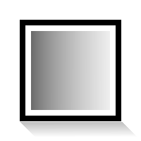

