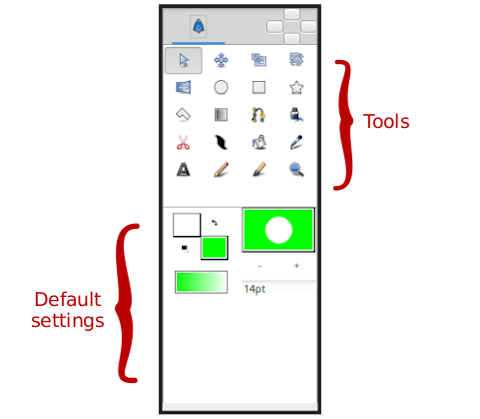

.. _panel_toolbox:

########################
    Toolbox
########################
|Synfig\_icon.png| 

The **Toolbox Panel** is one of the main SynfigStudio `Panel <Panel>`__
- you can have several Canvas Window open, but only one **Toolbox Panel**.

   The Toolbox

Features of the Toolbox:
------------------------

-   Tools

-  `New Layer Defaults <New_Layer_Defaults>`__

