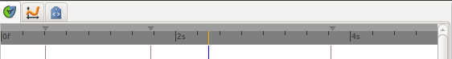
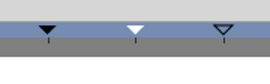

.. _timebar:

########################
    Timebar
########################

The ``Timebar`` is the area above the `Timetrack
Panel <Timetrack_Panel>`__, the `Graphs Panel <Graphs_Panel>`__ and
optionally at the bottom of the Canvas Window.

In the Timebar you could find informations about :

-  ``Project duration`` : as a frame ruler.
-  ``Current Time`` : The horizontal orange/blue line. You can click and
   drag within it to scrub your timeline.
-  `Keyframes <Keyframe>`__ : Their time, activation state and the
   selected one (not in the `Graphs Panel <Graphs_Panel>`__'s Timebar).

 
To change the scale of the Timeline put your mousepointer over the grey
frame ruler and use your mouse wheel to zoom in or out.

The Timebar at the bottom of the Canvas Window is optionally displayed by toggling the
|Time\_track\_icon.png| button at bottom left of the Canvas window.

.. note::
   Good to know : Timeline visibility
   
   The timeline at the bottom of the Canvas Window will not appear when you have defined
   zero duration in the `Canvas Properties Dialog <Canvas_Properties_Dialog>`__.

Keyframes in the Timebar
------------------------

   Three keyframes with three different states : **Normal**,
   **Selected** and **Deactivated**

You can adjust the Time ([Keyframe#Time]) of a keyframe by a normal drag
and drop. To adjust it's Length ([Keyframe#Length]), hold ``Alt`` key
when releasing the mouse button.

During a keyframe drag and drop operation a tooltip indicator will be
displayed with some time informations.

Right click over a keyframe or in upper part of the ``Timebar`` open the
`keyframe contextual menu <Keyframe_Menu>`__ giving access to the
keyframes actions.

